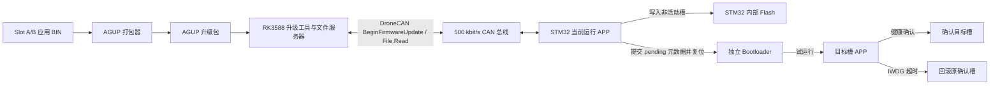
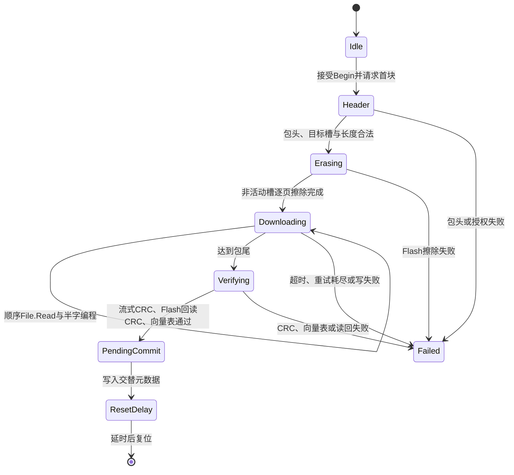
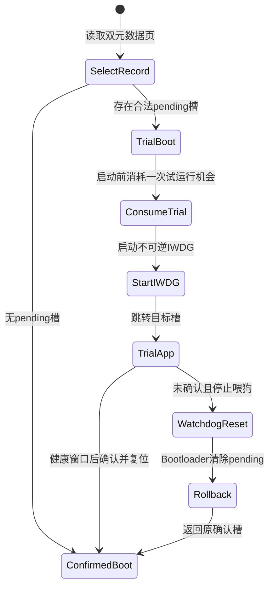

# AGS 控制板 MCU A/B 固件升级技术文档

> 文档状态：基于 2026-08-03 的源码、设计文档和台架日志整理。本文描述已实现的台架方案，不代表生产或飞行安全认证。

## 1. 文档目的

本文说明 AGS 控制板中 RK3588 通过 DroneCAN 为 STM32F103CB 更新固件的完整技术方案，重点覆盖：

- 系统边界与安全假设；
- STM32 Flash A/B 分区；
- DroneCAN 升级协议和 AGUP 包格式；
- APP 下载状态机、Bootloader 试运行与回滚；
- RK 侧打包、文件服务和一键升级工具；
- CAN 共存、异常恢复和可观测性；
- 已完成的测试、尚未验证的风险和生产化缺口。

本文不替代生产发布规范、飞行安全策略或密码学安全设计。

## 2. 项目背景与目标

AGS 控制板由 RK3588 主机和 STM32F103CB 控制 MCU 组成。MCU承担电源控制、板级状态管理、诊断记录以及 DroneCAN 节点功能。早期固件更新依赖外部 SWD 编程器，不适合整机装配后的维护。

本项目的目标是在保留现场恢复能力的前提下，实现 RK 到 MCU 的在线升级：

1. 运行中的镜像不能覆盖自身或已确认镜像；
2. 新镜像只有完整下载并通过校验后才能进入试运行；
3. 新镜像未能在规定时间内确认健康时，Bootloader 自动回滚；
4. 元数据更新中断时仍能找到上一个有效记录；
5. RK 侧必须能判定“下载完成、目标重启、恢复运行、CAN最终健康”；
6. 生产策略默认拒绝升级，台架模式必须显式开启。

当前方案定位为台架可验证实现。它使用 CRC32 检查传输和存储完整性，但还没有数字签名、可信密钥、硬件兼容证书和反回滚计数器。

## 3. 系统范围

### 3.1 系统组成



### 3.2 组件职责

| 组件 | 主要职责 |
| --- | --- |
| RK 打包器 | 检查槽位、镜像长度、初始栈指针和复位向量，生成 AGUP 包 |
| RK 升级工具 | 提供 DroneCAN 文件服务，发起升级，跟踪 NodeStatus 和读取次数 |
| RK 一键包装脚本 | 固定台架参数，归档 candump/结果日志，执行升级后探测和 CAN 恢复门 |
| STM32 当前 APP | 接收 Begin 请求、主动拉取文件、擦写非活动槽、验证并提交 pending 状态 |
| STM32 Bootloader | 选择启动槽、消耗试运行次数、启动 IWDG、处理确认或回滚 |
| 双元数据页 | 以交替记录保存确认槽、待试运行槽、版本、序号和 CRC |

### 3.3 不在当前范围内的能力

- 空片或旧版非 A/B 固件的首次引导；首次部署仍需 SWD。
- 对升级包进行数字签名验证。
- 防止合法旧版本降级。
- 根据真实飞行状态、任务状态或安全域授权升级。
- 在代表性多节点负载下给出最大允许总线利用率。
- 对任意断电时刻给出已经过硬件验证的恢复保证。

## 4. 运行环境与约束

| 项目 | 当前台架配置 |
| --- | --- |
| MCU | STM32F103CB |
| 主机 | RK3588 Linux |
| 总线 | CAN 500 kbit/s |
| MCU DroneCAN 节点 | 台架固定节点 42 |
| RK 文件服务器节点 | 台架固定节点 120 |
| MCU APP 工具链 | ARM GNU Toolchain、GNU Make |
| RK 工具 | Python、Shell、SocketCAN、candump/cansend |
| 升级入口 | `uavcan.protocol.file.BeginFirmwareUpdate` |
| 文件传输 | `uavcan.protocol.file.Read` |

台架固件必须显式以 `AB_UPDATE_BENCH_ALLOW=1` 构建。默认值或 `AB_UPDATE_BENCH_ALLOW=0` 的构建会拒绝升级入口。

## 5. Flash 分区设计

### 5.1 分区布局

| 区域 | 起始地址 | 大小 | 所有者与用途 |
| --- | ---: | ---: | --- |
| Bootloader | `0x08000000` | 16 KiB | 启动选择、试运行和回滚 |
| Slot A | `0x08004000` | 52 KiB | 应用镜像 A |
| Slot B | `0x08011000` | 52 KiB | 应用镜像 B |
| Reserved | `0x0801E000` | 6 KiB | 预留恢复或安全数据 |
| Metadata Page 0 | `0x0801F800` | 1 KiB | A/B 元数据记录 0 |
| Metadata Page 1 | `0x0801FC00` | 1 KiB | A/B 元数据记录 1 |

每个应用必须按目标槽地址单独链接，向量表和所有绝对引用必须落在对应槽内。APP只允许擦除和写入 `AB_OtherSlot(AGS_APP_SLOT_ID)` 指向的非活动槽。

### 5.2 双元数据页

元数据采用双页交替提交，而不是原地覆盖：

1. 读取两页记录；
2. 检查 magic、序号和 CRC；
3. 选择序号最新的有效记录；
4. 新状态写入另一页；
5. 最后写有效标志，使中途断电不会覆盖旧记录的可用性。

元数据至少表达以下状态：

- 当前确认槽；
- 待试运行槽；
- 镜像版本；
- 剩余试运行次数；
- 单调递增记录序号；
- 记录完整性 CRC。

双页交替能降低元数据提交中断造成无有效记录的风险，但仍需针对每个擦写和提交阶段完成真实断电矩阵测试。

## 6. AGUP 升级包

### 6.1 包结构

AGUP由32字节小端头和槽位链接的应用二进制组成。

| 偏移 | 长度 | 字段 | 说明 |
| ---: | ---: | --- | --- |
| 0 | 4 | Magic | ASCII `AGUP` |
| 4 | 2 | Format Version | 当前为1 |
| 6 | 2 | Header Size | 固定32 |
| 8 | 4 | Target Slot | A=0，B=1 |
| 12 | 4 | Image Length | 应用镜像长度 |
| 16 | 4 | Image CRC32 | 应用镜像完整性 |
| 20 | 4 | Image Version | 版本记录 |
| 24 | 4 | Flags | 当前为0 |
| 28 | 4 | Header CRC32 | 对0—27字节计算 |

### 6.2 打包阶段检查

打包器会拒绝：

- 大于52 KiB的应用；
- 初始MSP不在合法RAM范围内；
- Reset Handler不位于目标槽；
- 输入镜像实际链接槽与命令行目标槽不一致。

台架分区上限测试支持先验证真实镜像，再用 `0x00` 填充到恰好52 KiB。最大AGUP大小为53,280字节，其中32字节为头部，53,248字节为镜像。

CRC32只解决非恶意损坏检测，不能证明来源可信，也不能防止镜像被有意替换。

## 7. DroneCAN 升级协议

### 7.1 服务约定

| 参数 | 取值 |
| --- | --- |
| 发起服务 | `BeginFirmwareUpdate` |
| 拉取服务 | `File.Read` |
| 单块最大数据 | 256字节 |
| 偏移规则 | 严格顺序递增 |
| 请求优先级 | Low |
| 最小请求间隔 | 20 ms |
| 响应超时 | 1500 ms |
| 失败退避 | 100 ms |
| 最大重试 | 5次 |
| 并发会话 | 1个 |

MCU在接受Begin前检查：

1. 请求源是否为授权RK节点；
2. 当前是否已有升级会话；
3. 是否存在尚未完成的试运行；
4. 请求路径和文件服务器节点是否合法；
5. 台架升级策略是否显式打开；
6. 当前电源状态和CAN状态是否满足台架门限。

升级期间 NodeStatus 切换至 `MODE_SOFTWARE_UPDATE`。下载推进由周期任务驱动，而不是在CAN接收回调中直接执行，以避免长时Flash操作阻塞协议接收路径。

### 7.2 CAN接收隔离

- bxCAN过滤器只接收目标为MCU节点42的扩展DroneCAN服务帧。
- 额外保留一个临时11位诊断ping ID。
- RX中断只完成入队，主循环每次最多处理16帧。
- 软件环形队列深度为32，可观测FIFO满、队列溢出、接收错误和Bus-Off。
- libcanard使用4 KiB内存池，并继续执行服务类型和源节点检查。

File.Read使用低优先级，让高优先级业务帧优先仲裁。该策略应使总线负载优先表现为升级变慢或超时，而不是影响已确认槽，但其延迟上限仍需硬件负载测试确定。

## 8. 升级状态机

### 8.1 APP下载和提交



下载过程中不会修改已确认槽。只有完整镜像通过校验后，系统才写入pending元数据。

### 8.2 Bootloader试运行和回滚



试运行镜像在2秒健康窗口后确认自身；若保持不健康，5秒后停止喂狗，IWDG复位使Bootloader回滚。

### 8.3 连续升级中的IWDG问题

IWDG一旦由试运行Bootloader启动，确认后也无法由软件关闭。早期实现进入下一次升级时清除了软件侧 `watchdog_required` 标志，导致物理IWDG仍在运行但升级过程不再喂狗，传输中途发生回滚。

修复策略是在 `AB_Update_Begin()` 清理下载状态时保留“硬件看门狗已经运行”的事实。后续连续A/B升级均覆盖了继承IWDG的场景。

## 9. RK主机工具

### 9.1 工具链

| 工具 | 用途 |
| --- | --- |
| `package_mcu_update.py` | 从槽位BIN生成AGUP |
| `package_ab_firmware.py` | 合并Bootloader、初始Slot A和metadata，生成工厂HEX |
| `rk_mcu_firmware_update.py` | DroneCAN文件服务、Begin发起、NodeStatus跟踪和结果判定 |
| `rk_mcu_ab_upgrade.sh` | 面向操作员的一键A/B升级入口 |
| `rk_mcu_ab_stress_test.sh` | 按确认槽开始交替升级，首个失败即停止 |

### 9.2 成功判据

RK不能只以“目标重新出现”判断成功。一轮升级必须同时满足：

1. 升级前收到有效NodeStatus基线；
2. 观察到 `MODE_SOFTWARE_UPDATE`；
3. File.Read请求数不小于 `ceil(包大小 / 256)`；
4. 观察到目标复位；
5. 目标重新进入正常运行模式；
6. 10秒探测期收到规定数量的NodeStatus；
7. 工具和包装脚本均输出 `RESULT=PASS`；
8. 最终CAN状态为 `ERROR-ACTIVE`。

重复的最后一块读取符合File.Read重试语义，因此实际读取数可以略高于理论值，但不能低于理论值。

### 9.3 MCU复位窗口与CAN恢复

MCU复位期间没有ACK，RK发送端可能积累错误并进入 `ERROR-WARNING`。仅被动接收NodeStatus不会降低发送错误计数。

台架包装脚本只在升级与10秒探测都已经通过后尝试恢复：

1. 若CAN已经 `ERROR-ACTIVE`，不做额外操作；
2. 否则发送150个标准诊断ping；
3. 必须收到150个匹配pong；
4. 再次读取接口状态，必须恢复 `ERROR-ACTIVE`；
5. 任一步失败则整轮失败。

脚本不会通过重置CAN接口来隐藏错误计数。该恢复只属于台架控制手段，不是生产CAN策略。

## 10. 构建、打包与部署

### 10.1 构建两个应用槽

```powershell
make -C firmware/AGS_PowerCtrl -j 8 `
  APP_SLOT=A AB_UPDATE_BENCH_ALLOW=1 `
  BUILD_DIR=build/release_slot_a

make -C firmware/AGS_PowerCtrl -j 8 `
  APP_SLOT=B AB_UPDATE_BENCH_ALLOW=1 `
  BUILD_DIR=build/release_slot_b
```

### 10.2 生成AGUP包

```powershell
python tools/package_mcu_update.py `
  --input firmware/AGS_PowerCtrl/build/release_slot_a/AGS_PowerCtrl_A.bin `
  --slot A --version 4 `
  --output firmware/AGS_PowerCtrl/build/release_slot_a/AGS_PowerCtrl_A_v4.agup

python tools/package_mcu_update.py `
  --input firmware/AGS_PowerCtrl/build/release_slot_b/AGS_PowerCtrl_B.bin `
  --slot B --version 4 `
  --output firmware/AGS_PowerCtrl/build/release_slot_b/AGS_PowerCtrl_B_v4.agup
```

### 10.3 生成首次烧录工厂HEX

```powershell
make -C firmware/AGS_Bootloader -j 8

python tools/package_ab_firmware.py `
  --bootloader firmware/AGS_Bootloader/build/AGS_Bootloader.hex `
  --slot-a firmware/AGS_PowerCtrl/build/release_slot_a/AGS_PowerCtrl_A.hex `
  --confirmed A --version-a 4 `
  --output firmware/AGS_PowerCtrl/build/factory/AGS_MCU_Factory_A_v4.hex `
  --manifest firmware/AGS_PowerCtrl/build/factory/AGS_MCU_Factory_A_v4.json
```

空片、旧非A/B固件或Bootloader不匹配时，必须通过ST-Link/J-Link等外部工具烧录工厂HEX。OTA升级器只接受AGUP，不接受裸HEX或BIN。

### 10.4 台架升级

在RK部署目录中完成接口、NodeStatus、包哈希和当前确认槽检查后执行：

```sh
./mcu_ab_upgrade.sh B
./mcu_ab_upgrade.sh A
```

每次只能选择当前确认槽的相反槽。当前GetNodeInfo不提供活动槽，因此操作员必须以最近一次满足全部成功判据的记录为准。

## 11. 代码组织

| 路径 | 作用 |
| --- | --- |
| `firmware/AGS_Bootloader/Core/Src/bootloader_main.c` | 启动选择、试运行和跳转 |
| `firmware/AGS_Bootloader/Core/Src/boot_flash.c` | Bootloader Flash与元数据访问 |
| `firmware/AGS_PowerCtrl/Core/Src/ab_update.c` | APP侧A/B下载和写入流程 |
| `firmware/AGS_PowerCtrl/Core/Src/ab_update_policy.c` | 升级授权和安全门 |
| `firmware/AGS_PowerCtrl/Core/Src/dronecan_firmware_update.c` | Begin/File.Read协议适配 |
| `firmware/AGS_PowerCtrl/Core/Src/dronecan_node.c` | DroneCAN节点、调度与服务分发 |
| `tools/package_mcu_update.py` | AGUP打包与静态检查 |
| `tools/rk_mcu_firmware_update.py` | RK升级器与文件服务器 |
| `tests/test_ab_boot.py` | Bootloader、元数据和试运行测试 |
| `tests/test_mcu_firmware_update.py` | MCU升级状态机测试 |
| `tests/test_rk_mcu_ab_upgrade.py` | RK包装脚本判定测试 |

## 12. 验证方法与结果

### 12.1 主机侧验证

仓库包含7个主要测试文件，覆盖Bootloader、CAN bring-up、DroneCAN节点、MCU升级状态机、电源控制、RK升级器和包装脚本。当前状态记录为69项主机测试通过。

主机测试用于验证状态转移、输入拒绝、包格式、脚本结果判定和故障注入，不能替代真实Flash、IWDG和CAN台架测试。

### 12.2 十轮硬件升级

台架完成：

- 6轮普通v3镜像A/B交替；
- 4轮恰好填满52 KiB应用槽的v4镜像A/B交替；
- 每轮均满足理论File.Read数量；
- 每轮均完成目标启动、试运行确认和10秒探测；
- 需要恢复的轮次均完成150/150 ping/pong并回到 `ERROR-ACTIVE`。

普通镜像理论读取数为129，实测为129—131；满槽镜像理论读取数为209，实测为210—211。高于理论值来自合法重试。

第10轮后又完成30秒被动探测，连续收到30条正常NodeStatus，并通过GetNodeInfo。最终CAN为 `ERROR-ACTIVE`，Bus-Off为0，报文级RX/TX错误、丢包和missed frame均为0。

### 12.3 本轮可以证明的结论

- 非活动槽限制有效；
- 普通镜像和满槽镜像能够完整下载；
- 流式CRC、Flash回读、向量表和提交路径能够闭环；
- 试运行确认和连续升级中的IWDG保持路径有效；
- MCU复位造成的部分CAN错误状态可以通过严格台架门恢复。

### 12.4 本轮不能证明的结论

- 不健康镜像在所有故障模式下都能回滚；
- 任意擦写点断电都不会造成不可恢复状态；
- 文件服务器丢失、分块损坏和恶意输入均已覆盖；
- 多节点高负载下关键帧延迟满足产品要求；
- 升级包来源可信或版本不可回退；
- 该功能可以在未知飞行状态中开启。

## 13. 典型问题与复盘

### 13.1 连续升级中途回滚

现象：第一次升级能够成功，后续反向升级在文件未读完时复位并回到旧槽。

根因：试运行Bootloader启动的IWDG在确认后仍持续运行；Begin处理清除了软件喂狗标志，导致硬件IWDG无人维护。

修复：清理下载状态时保留不可逆IWDG已经启动的事实，并要求RK端只有在读取数达到理论值后才能报告成功。

经验：不可逆硬件状态不能只由一次性软件变量表示；连续操作测试比单轮成功更容易暴露跨会话状态泄漏。

### 13.2 目标已经启动但RK端CAN进入ERROR-WARNING

现象：目标APP已运行并持续发布NodeStatus，但RK发送错误计数没有恢复。

根因：MCU复位窗口无ACK，主动发送端累计协议错误；被动接收不能抵消发送计数。

修复：在目标升级和运行探测均通过后，执行150次诊断请求/响应，并把150/150和最终 `ERROR-ACTIVE` 作为同一门限。

经验：应用层“服务恢复”与链路层“控制器健康”是两个不同结论，验证工具必须同时记录。

## 14. 安全性与生产化缺口

| 风险 | 当前状态 | 建议 |
| --- | --- | --- |
| 包来源伪造 | 未解决 | 使用数字签名、可信公钥和签名覆盖的清单 |
| 版本回退 | 未解决 | 引入受保护的单调版本计数 |
| 硬件不兼容镜像 | 仅检查槽位和向量 | 增加板型、硬件版本和兼容矩阵 |
| 未授权时机升级 | 仅台架电源/CAN门 | 接入真实飞行状态与安全授权 |
| 断电恢复 | 设计上考虑，硬件矩阵不足 | 对擦除、下载、提交和确认逐点断电 |
| 多节点负载 | 有过滤和优先级设计 | 测量总线利用率、FIFO溢出和关键帧延迟 |
| CAN复位窗口 | 仅台架恢复策略 | 定义生产控制器错误恢复与业务降级策略 |

在完成上述工作前，生产构建必须保持升级入口默认关闭。

## 15. 后续工作

1. 增加签名、可信密钥、硬件兼容和反回滚设计。
2. 建立不健康镜像、包损坏、服务器中断和重试耗尽测试矩阵。
3. 对Flash擦除、下载、metadata提交、试运行和确认阶段执行逐点断电测试。
4. 在代表性多节点负载下测量File.Read延迟、CAN FIFO和关键业务帧时延。
5. 将活动槽、确认槽、版本和升级原因纳入可查询诊断接口。
6. 明确生产CAN错误恢复策略，避免依赖台架诊断ping。

## 16. 原始资料索引

本地源码根目录：`D:\WORK\AGS_ctrl_board`

重点资料：

- `docs/design/rk-mcu-ab-firmware-update.md`
- `docs/verification/mcu-ab-firmware-update.md`
- `docs/verification/mcu-ab-upgrade-operation-guide.md`
- `docs/evidence/2026-08-03-mcu-ab-10-round-and-slot-limit-hardware-pass.md`
- `docs/evidence/2026-07-31-mcu-ab-b-to-a-watchdog-and-v3-pass.md`
- `docs/decisions/2026-08-03-rk-can-reset-window-recovery-gate.md`
- `docs/project-status.md`

原始日志包含设备地址和台架身份，引用或对外分享前应脱敏。
