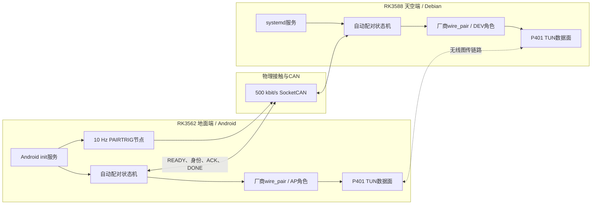
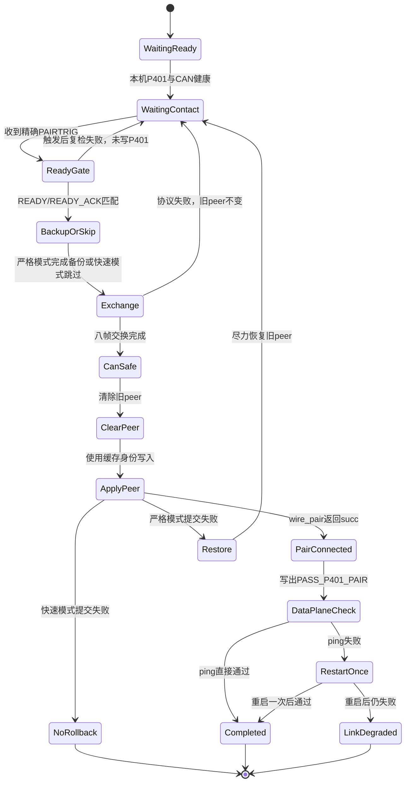

# RK3562—RK3588 P401 CAN 自动配对技术文档

> 文档状态：基于 2026-08-03 的协议脚本、部署包和硬件日志整理。本文区分“基础六帧交换已上板通过”和“最新八帧自动配对流程仍待完整硬件验收”。

## 1. 文档目的

本文描述 RK3562 地面端与 RK3588 天空端通过CAN交换P401设备身份并完成自动配对的设计与实现，覆盖：

- 系统角色和身份模型；
- 接触触发、READY会话门和身份交换协议；
- P401运行时及持久化peer写入；
- Android init和Linux systemd服务；
- 快速模式、严格备份模式和失败策略；
- 数据链路恢复、状态文件与可观测性；
- 已完成的真实板卡验证和未完成的验收项。

文档中的设备地址和真实四字节身份均已省略。CAN协议常量属于实现接口，予以保留。

## 2. 项目背景

P401图传设备需要在地面端AP角色和天空端DEV角色之间配置对端身份。传统流程依赖人工读取身份、分别登录两块板卡并调用厂商工具，步骤多且容易把错误身份写入持久化配置。

系统已有一条RK3562与RK3588之间的物理CAN链路，因此项目选择在CAN上完成双方身份发现和确认，再调用各自板端的厂商接口提交peer。这样可以实现“设备接触后自动交换身份，脱离接触后继续完成图传连接”。

项目的主要目标是：

1. 只使用厂商定义的P401四字节身份，不混用TUN、USB或以太网MAC；
2. 在任何持久化写入之前完成双向身份确认；
3. CAN不健康、身份不合法或会话不匹配时保持原peer不变；
4. 将CAN接触阶段与P401写入、重枚举、数据面恢复阶段解耦；
5. 支持Android地面端和Debian天空端自动启动、部署、停止与状态查询；
6. 记录足够的阶段状态，能够区分交换失败、提交失败和数据面退化。

## 3. 系统架构



### 3.1 角色职责

| 角色 | 职责 |
| --- | --- |
| 地面RK3562 | 发送接触触发，接收天空READY，参与身份交换，写入天空DEV身份，保持多会话等待 |
| 天空RK3588 | 接收精确触发，发布本机READY，参与身份交换，写入地面AP身份，单会话成功后退出 |
| CAN链路 | 只传递会话门、双方身份、ACK和完成确认，不承载P401数据面 |
| 厂商 `wire_pair` | 读取本机四字节身份，写入运行时和持久化peer，验证连接结果 |
| P401 TUN | 配对成功后的业务数据面，用双向ping进行最小连通性检查 |

### 3.2 设计边界

- 自动配对服务不负责修复CAN电气、驱动或采样点问题。
- 服务不主动拉起、复位或重配CAN，只消费已有CAN自启服务提供的健康接口。
- 自动流程只修改P401 peer，不刷写boot、rootfs或完整固件。
- P401写入后可能发生USB重枚举和图传短暂断开，这是预期行为。

## 4. 身份模型

### 4.1 权威身份

配对身份来自：

```sh
wire_pair --get-local-mac --role <ap|dev> -u 0
```

工具输出的四字节值是协议中的权威身份。TUN地址、USB设备地址和普通网卡MAC都不能代替它。

### 4.2 CAN载荷格式

身份帧使用8字节载荷：

```text
00 00 ID0 ID1 ID2 ID3 01 C0
```

约束包括：

- 身份长度严格为4字节；
- 前缀必须为 `00 00`；
- 后缀必须为 `01 C0`；
- READY、Report、ACK和DONE阶段必须携带预期的同一身份；
- 本机身份和对端身份不能为空或格式异常。

这些检查用于阻止旧格式杂帧或错误设备身份进入提交阶段。

## 5. 协议分层

自动配对协议分为三层：

1. **接触层**：地面端以固定帧声明有新配对会话；
2. **会话层**：天空发布READY，地面用携带同一天空身份的ACK接受该会话；
3. **交换层**：双方交换身份、逐向确认，并以DONE/DONE_ACK关闭CAN阶段。

只有交换层完成后，系统才允许清除旧peer或调用厂商写入接口。

## 6. 接触触发与READY会话门

### 6.1 10 Hz专用触发

地面端在CAN健康时约每100 ms发送一次：

```text
CAN ID:  07200702
Payload: 50 41 49 52 54 52 49 47
ASCII:   PAIRTRIG
```

触发节点不配置、不重启也不关闭CAN。若接口不是500 kbit/s、normal或 `ERROR-ACTIVE`，节点暂停发送。

当状态目录出现合法的 `PASS_P401_PAIR` 和 `P401_CONNECTED=1` 后，触发节点停止发送并退出。下一次换板需要重新建立会话，不能让上一轮停发标志污染下一轮。

### 6.2 READY和READY_ACK

天空收到精确的PAIRTRIG后，发布：

```text
sky -> ground  07200501#0000<SKY_P401_ID>01C0
```

地面验证身份格式后回复：

```text
ground -> sky  07200502#0000<SKY_P401_ID>01C0
```

天空只有收到与本机身份完全一致的READY_ACK后，才进入身份交换。这样可以避免旧READY、其他天空板READY或跨会话ACK触发错误写入。

快速路径中READY_ACK重复发送两次，间隔50 ms，以降低用户态进程调度和接收启动时序造成的单帧丢失。

## 7. 身份交换协议

### 7.1 基础六帧协议

最初完成硬件验证的版本使用六帧：

| 顺序 | 方向 | CAN ID | 数据含义 |
| ---: | --- | --- | --- |
| 1 | Ground→Sky | `07200102` | ASCII `GNDHELLO` |
| 2 | Sky→Ground | `07200101` | ASCII `SKYHELLO` |
| 3 | Ground→Sky | `07200302` | 地面AP四字节身份 |
| 4 | Sky→Ground | `07200401` | 对地面身份的ACK |
| 5 | Sky→Ground | `07200301` | 天空DEV四字节身份 |
| 6 | Ground→Sky | `07200402` | 对天空身份的ACK |

该版本已经完成真实双板 `PASS_EXCHANGE` 和后续 `PASS_COMMIT`。

### 7.2 当前八帧协议

自动化版本在六帧后增加：

| 顺序 | 方向 | CAN ID | 数据含义 |
| ---: | --- | --- | --- |
| 7 | Sky→Ground | `07200601` | `SKY_DONE`，确认天空已完成交换 |
| 8 | Ground→Sky | `07200602` | `GROUND_DONE_ACK`，确认双方均可结束CAN阶段 |

DONE握手解决的核心问题是：收到最后一条身份ACK的一端不能单方面假设对端也已经缓存成功。八帧结束后写出：

```text
RESULT=PASS_CAN_EXCHANGE
CAN_SAFE_TO_DISCONNECT=1
```

该状态表示双方已经确认并缓存身份，物理接触可以断开；它不代表P401已经写入，也不代表TUN数据面已恢复。

## 8. 自动配对状态机



### 8.1 关键不变量

- 身份交换完成前不得清除旧peer。
- READY载荷必须对应当前天空本机身份。
- Report和ACK必须逐字节匹配。
- CAN阶段成功后，提交阶段只使用缓存身份，不再依赖物理接触。
- 地面和天空必须分别确认本机厂商工具返回 `succ`。
- 失败状态必须说明是否发生过CAN TX、是否开始P401写入、是否具有回滚备份。

## 9. P401提交与回滚策略

### 9.1 快速模式

当前部署包装默认 `BACKUP_ENABLE=0`，以减少读取旧peer和等待厂商工具的时间。

特点：

- CAN交换失败时旧peer完全不动；
- 交换成功后清除旧peer，再写入新peer；
- clear后commit失败时没有旧值可恢复；
- 状态记为 `FAIL_NO_ROLLBACK`，需要重新接触配对或人工写回。

快速模式适合受控台架降低配对延迟，但提高了提交阶段失败后的人工恢复成本。

### 9.2 严格备份模式

显式设置 `BACKUP_ENABLE=1` 后，状态机会在清除前保存当前运行时和持久化peer。

提交失败时尝试调用窄范围恢复工具写回旧值。该策略只能保证本端“尽力恢复”，不能形成跨两端事务，也不能保证厂商设备在USB重枚举异常时一定恢复。

### 9.3 显式提交授权

手动验证器把非写入交换和持久化提交分离。只有两端都带显式写入令牌时，commit阶段才调用厂商工具。该门用于防止调试脚本或误操作直接改变运行时及MiniDB状态。

## 10. 数据面检查

双方成功写入peer后，状态机对预定义的对端TUN地址执行ping：

1. 首次ping通过：`PASS_NO_RESTART`；
2. 首次失败：只重启一次本端P401图传服务；
3. 重启后通过：`PASS_AFTER_RESTART`；
4. 重启后仍失败：`PASS_LINK_DEGRADED`。

`PASS_LINK_DEGRADED`表示身份写入已经成功且保留，但业务数据面未恢复。此状态不会重复清除和写入peer，避免在链路故障时形成破坏性重试循环。

## 11. CAN健康门与失败策略

### 11.1 前置检查

进入协议前至少检查：

- 接口存在且为UP；
- bitrate为500 kbit/s；
- 工作模式为normal；
- 当前状态为 `ERROR-ACTIVE`；
- 天空端控制器时钟为板级期望值；
- 当前错误计数没有在检查窗口内增长；
- 本机P401守护进程和身份查询可用。

检查失败时不发送应用CAN帧，也不写P401。

### 11.2 自动模式与手动模式

| 模式 | 失败后CAN处理 |
| --- | --- |
| 板内自动模式 | 默认 `VALIDATOR_FAIL_DOWN=0`，记录失败但不强制接口DOWN |
| 独立手动验证器 | 默认 `FAIL_DOWN=1`，严格诊断时可请求接口DOWN |

自动模式不强制DOWN，是为了避免短暂丢帧或启动时序差异破坏由既有服务管理的CAN接口。身份格式、READY/ACK会话门和持久化写入条件没有因此放宽。

天空systemd服务使用 `Restart=on-failure` 和5秒延迟。失败后可以重新布防；成功以退出码0结束，不会对仍接触的同一块板反复配对。

## 12. 软件组成

| 文件 | 作用 |
| --- | --- |
| `p401_auto_pair_on_contact.sh` | 公共状态机、单实例、会话门、备份、清除、提交和数据面检查 |
| `p401_can_mac_exchange_validate.sh` | CAN健康检查、八帧交换和本地apply-peer动作 |
| `ground_pair_trigger_10hz.sh` | 地面10 Hz专用触发节点 |
| `ground_auto_pair_on_contact.sh` | Android路径、角色和厂商工具包装 |
| `sky_auto_pair_on_contact.sh` | Debian路径、角色和厂商工具包装 |
| `ground_p401_auto_pair.rc` | Android init服务与持久属性门 |
| `sky-p401-auto-pair.service` | 天空systemd服务 |
| `wire_pair_probe_clear` | 受限的查询、清除和恢复工具 |
| `src/tests/test_auto_pair_on_contact.sh` | 离线mock状态机测试 |

单实例锁用于避免同一端同时存在两个配对过程。每轮状态、日志、备份和阶段性结果写入独立状态目录，便于断点定位。

## 13. 部署与运行

### 13.1 天空端安装但不布防

```powershell
.\deploy\sky-wifi\deploy_sky_wifi.ps1 -HostIp <SKY_IP>
```

安全安装模式将文件写入 `/userdata` 并注册systemd unit，但保持服务停止。安装过程不发送CAN、不写P401、不刷写镜像。

### 13.2 地面端安装但不布防

```powershell
.\deploy\ground-adb\deploy_ground.ps1 -AdbSerial <ADB_SERIAL>
```

部署脚本写入应用目录并安装Android init定义，最终把 `/vendor` 恢复为只读，同时将布防属性设为0。新rc需要重启后由init加载。

### 13.3 布防顺序

确认两端CAN长期保持normal/`ERROR-ACTIVE`后，先布防天空，再布防地面：

```sh
# Sky
systemctl enable --now sky-p401-auto-pair.service

# Ground
setprop persist.vendor.p401.auto_pair 1
```

地面布防后开始发送10 Hz专用触发。触发具有CAN发送能力，可能立即进入持久化配对，不能在未知设备或未确认接线时执行。

### 13.4 安全停止

```sh
# Sky
systemctl disable --now sky-p401-auto-pair.service

# Ground
setprop persist.vendor.p401.auto_pair 0
```

快速模式若恰好在clear后、commit前停止，无法自动恢复旧peer。停止前应先查看状态文件，确认是否已经进入P401写入阶段。

### 13.5 只读状态检查

```sh
# Sky
systemctl status sky-p401-auto-pair.service --no-pager
cat /userdata/p401_auto_pair/state/auto_pair.env

# Ground
getprop init.svc.ground_p401_auto_pair
getprop persist.vendor.p401.auto_pair
cat /data/local/tmp/p401_auto_pair/state/auto_pair.env
```

只读查询不发送CAN、不重启服务、不写P401。

## 14. 状态与结果定义

| 结果 | 含义 |
| --- | --- |
| `PASS_EXCHANGE` | 双方身份与ACK交换完成，没有P401写入 |
| `PASS_CAN_EXCHANGE` | 当前八帧交换完成，身份已缓存，接触可断开 |
| `PASS_COMMIT` | 本端厂商工具完成运行时和持久化写入 |
| `PASS_P401_PAIR` | 本端P401确认连接目标peer |
| `PASS_NO_RESTART` | 数据面首次检查直接通过 |
| `PASS_AFTER_RESTART` | 本端图传服务重启一次后恢复 |
| `PASS_LINK_DEGRADED` | peer已提交，但一次重启后数据面仍失败 |
| `FAIL_RESTORED` | 严格模式失败并尝试恢复旧peer |
| `FAIL_NO_ROLLBACK` | 快速模式在写入阶段失败，无备份可恢复 |
| `WAITING_CONTACT` | 天空等待精确PAIRTRIG |
| `WAITING_SKY_READY` | 地面等待天空READY，可继续多会话 |

这些状态必须结合 `CAN_TX_PERFORMED`、`P401_WRITE_PERFORMED`、备份路径和阶段日志解释，不能只读取一个PASS/FAIL字符串。

## 15. 验证结果

### 15.1 离线测试

离线mock覆盖：

- 天地端正常交换和提交；
- 触发丢失、READY错配和身份格式错误；
- 写入令牌缺失；
- CAN错误状态和错误计数增长；
- 快速模式无回滚失败；
- 严格模式恢复；
- 多块天空板连续会话；
- 数据面直接通过、重启恢复和持续退化；
- 10 Hz触发成功后停发；
- 自动模式不强制DOWN与手动严格覆盖。

部署包还检查Shell/PowerShell语法、SHA-256清单和包内文件一致性。

### 15.2 基础协议硬件通过

真实双板验证已完成以下闭环：

1. 地面和天空均通过500 kbit/s、`ERROR-ACTIVE`前置检查；
2. 双方各发送3条应用CAN帧，六帧身份交换完成；
3. 两端均输出 `PASS_EXCHANGE`；
4. CAN错误、重启、仲裁丢失、Error-Warning、Error-Passive和Bus-Off计数保持0；
5. 使用显式令牌后，两端厂商工具均返回 `succ` 和 `PASS_COMMIT`；
6. 运行时与持久化peer读回正确；
7. 配对后TUN双向各3个ICMP包均通过，丢包率0%。

### 15.3 最新自动化版本的验证边界

10 Hz专用触发、READY会话门、八帧DONE握手和低延迟参数已完成离线测试及两端安全部署检查。但部署时没有真正发送或接收专用触发，也没有执行新的P401写入。

因此目前不能声明：

- 最新八帧版本已经完成完整接触配对；
- 物理接触到P401连接已经稳定小于3秒；
- P50/P95延迟已测量；
- 多块天空板反复换板已经完成硬件压力测试；
- 双P401冷启动后持久化一定保持。

## 16. 典型故障与设计复盘

### 16.1 用旧业务心跳作为接触触发

问题：早期使用已有MCU周期帧判断接触，但该帧在实际系统中可能持续存在，无法可靠表示新接触或松开。

处理：新增固定扩展ID和ASCII `PAIRTRIG`载荷，由独立地面节点以10 Hz发送，并在P401连接后停止。

经验：物理事件触发不应复用语义不同的业务心跳；触发源、会话ID和停止条件必须独立。

### 16.2 地面服务单次成功后退出

问题：第一块天空板配对成功后，地面进程退出，换第二块天空板时无人回复READY。

处理：地面改为多会话常驻流程，天空维持单会话；增加READY/ACK会话门防止跨轮写入。

经验：两端生命周期不对称时，必须明确谁常驻、谁按会话退出，以及下一轮如何重新布防。

### 16.3 CAN超时后强制接口DOWN

问题：自动流程中的短暂时序失败会把由其他系统服务管理的CAN接口强制关闭，扩大故障影响。

处理：板内自动模式默认不DOWN，只记录失败并恢复会话；独立手动验证器保留严格诊断行为。

经验：自动恢复策略不能越过资源所有权边界；诊断工具和产品服务需要不同的破坏性默认值。

### 16.4 快速模式没有旧peer备份

问题：为了降低延迟跳过备份后，一旦clear成功但commit失败，系统没有自动回滚数据。

处理：明确输出 `FAIL_NO_ROLLBACK`，禁止伪装成普通失败；提供 `BACKUP_ENABLE=1` 严格模式。

经验：性能优化必须同时改变故障模型和操作手册，不能只缩短成功路径。

## 17. 安全性与风险

| 风险 | 当前控制 | 剩余问题 |
| --- | --- | --- |
| 错误设备身份 | 精确四字节格式、READY绑定和ACK匹配 | 没有密码学设备认证 |
| CAN杂帧 | 精确扩展ID、完整载荷和会话门 | 总线可被有权限节点伪造 |
| 错误持久化写入 | 交换先于clear、显式commit门 | 快速模式提交失败无回滚 |
| 跨会话污染 | READY/ACK绑定天空身份、DONE握手 | 需要更多换板压力验证 |
| CAN状态退化 | 前置检查、错误计数门 | 不能修复电气或驱动根因 |
| 数据面未恢复 | ping、单次服务重启、退化状态 | 没有跨端事务回滚 |
| 服务重复运行 | 单实例锁和systemd/init管理 | 强制终止仍可能落在写入窗口 |

## 18. 后续工作

1. 在健康接触条件下完成最新八帧自动流程的真实双端验证。
2. 采集从首个PAIRTRIG到 `PASS_P401_PAIR` 的P50、P95和最大延迟。
3. 完成连续换板、短接触、抖动接触和并发杂帧压力测试。
4. 对两端P401执行冷启动，验证持久化peer和自动重连。
5. 评估默认快速模式是否符合产品可恢复性要求，必要时改为备份或事务式写入。
6. 为CAN身份协议增加会话随机数或密码学认证，降低重放和伪造风险。
7. 把协议版本、状态机版本和部署包版本写入状态文件，便于两端兼容检查。

## 19. 原始资料索引

本地源码根目录：`D:\WORK\CAN_TEST1\p401-auto-pair`

重点资料：

- `README.md`
- `src/README.md`
- `src/p401_auto_pair_on_contact.sh`
- `src/p401_can_mac_exchange_validate.sh`
- `src/ground_pair_trigger_10hz.sh`
- `src/tests/test_auto_pair_on_contact.sh`
- `docs/2026-07-29-p401-hostless-contact-auto-pair.md`
- `docs/2026-08-03-10hz-dedicated-trigger-and-latency.md`
- `D:\WORK\CAN_TEST1\docs\evidence\2026-07-28-true-p401-can-mac-exchange-validator.md`
- `D:\WORK\CAN_TEST1\docs\project-status.md`

原始日志可能包含设备身份、网络地址、认证路径和内部部署信息，对外分享前必须脱敏。
