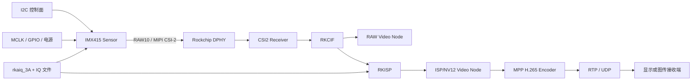

# RK3588 IMX415 1080p60 Camera Bring-up 技术文档

> 文档状态：基于 2026-08-05 前的驱动、设备树、板端日志和验证记录整理。
> 验证结论：`1920×1080@60fps` RAW10 模式已完成真实板卡验证；RAW 与 ISP/NV12 路径各完成 600 帧采集。
> 职责边界：基于现有 Rockchip/IMX415 V4L2 sensor driver 做板级模式适配、设备树链路调试、板端验证和问题定位，不表述为从零开发完整 sensor driver 或独立完成 AIQ 算法。

## 1. 文档目的

本文记录 RK3588 平台上 IMX415 摄像头 `1920×1080@60fps` 模式的适配与验证过程，覆盖：

- Camera 数据链路和各模块职责；
- V4L2 sensor driver 的模式参数；
- Device Tree 与 media graph 路由；
- RAW、ISP/NV12、H.265 和 RTP 的分层验证；
- `rkaiq_3A` 改写 vblank 导致黑帧的问题定位；
- 摄像头方位变化导致 Bayer 相位错误的处理；
- 已完成验证、工程规避和仍需补齐的长期方案。

本文既用于项目交接，也用于答辩或面试时解释“如何从最终黑屏逐层定位到具体控制参数”。

## 2. 项目背景与应用场景

目标设备是基于 RK3588 的无人系统计算节点，需要从 IMX415 获取视频，并经过 ISP、硬件编码和网络传输提供给上层显示或图传链路。

原有驱动具备 IMX415 基础支持，但当前板卡需要稳定的 `1920×1080@60fps` RAW10 模式。项目目标包括：

1. 让 sensor 在目标分辨率和帧率下稳定输出；
2. 确认 MIPI、RKCIF 和 RKISP media graph 连接正确；
3. 分别验证 RAW 与 ISP/NV12，避免只看最终画面；
4. 打通 MPP H.265 和 RTP/UDP 图传冒烟链路；
5. 定位 AIQ/IQ 与新模式不匹配引起的黑帧；
6. 为后续镜像集成保留可重复的验证方法。

## 3. 系统架构



### 3.1 各模块职责

| 模块 | 作用 | 常见故障表现 |
| --- | --- | --- |
| I2C | 读写 sensor 寄存器和芯片 ID | probe 失败、寄存器无响应 |
| MCLK/GPIO/电源 | 提供参考时钟、复位和上下电 | sensor 不响应、启动不稳定 |
| IMX415 | 输出 Bayer RAW10 图像 | 无帧、曝光异常、格式错误 |
| MIPI DPHY/CSI2 | 接收高速串行像素数据 | CRC/ECC、lane、同步和丢帧错误 |
| RKCIF | Rockchip Camera Interface 前端采集 | RAW 节点无数据或帧计数异常 |
| RKISP | 去马赛克、颜色处理、曝光增益相关处理和格式转换 | RAW 正常但 NV12 黑、偏色或异常 |
| rkaiq_3A | 用户态 3A 与 ISP 参数控制 | controls 被改写、IQ 模式不匹配 |
| MPP | Rockchip 硬件视频编码 | NV12 正常但编码失败 |
| RTP/UDP | 网络传输 | 编码正常但接收端无数据 |

### 3.2 为什么 probe 成功不等于出图成功

Sensor probe 通常只能证明：

- I2C 总线和地址基本正确；
- 芯片 ID 可以读取；
- 驱动匹配、基础时钟和供电达到最低条件。

它不能证明 MIPI lane、endpoint、RKCIF、RKISP、像素格式和编码链路全部正确。因此验证必须沿数据路径分层进行。

## 4. 目标模式与时序关系

### 4.1 目标模式

| 项目 | 确认值 |
| --- | --- |
| Sensor | Sony IMX415 |
| SoC | Rockchip RK3588 |
| 分辨率 | `1920×1080` |
| 帧率 | `60.00 fps` |
| Sensor 输出 | RAW10 Bayer |
| MIPI | CSI-2，多 lane 配置与驱动/设备树一致 |
| 稳定 VTS | `0x08CA = 2250` |
| 有效高度 | `1080` |
| 稳定 vblank | `2250 - 1080 = 1170` |
| 稳定 controls | vblank `1170`、exposure `676`、analogue gain `80` |

### 4.2 HTS、VTS、vblank 与帧率

可以用下面的关系理解 sensor timing：

```text
VTS = active_height + vertical_blanking
frame_time ≈ HTS × VTS / pixel_clock
fps ≈ pixel_clock / (HTS × VTS)
```

这里的 HTS/VTS 含义和驱动单位必须以 sensor 数据手册及当前驱动实现为准，不能只看寄存器十六进制值直接计算。驱动中的 mode table、寄存器表、`vts_def`、`hts_def`、`pixel_rate`、`link_frequency` 和 MIPI lane 配置必须相互一致。

修改帧率不是只改一个 `fps` 字段，原因包括：

- sensor 实际行/帧周期由 HTS、VTS 和时钟共同决定；
- exposure 上限依赖 VTS，不能超过安全帧长；
- MIPI lane 带宽必须容纳 RAW10 数据；
- V4L2 暴露的 blanking、pixel rate 和 link frequency 会被用户态读取；
- AIQ/IQ 文件可能根据 mode 名称和 controls 重新配置 sensor 与 ISP。

### 4.3 当前稳定参数

当前验证使用：

```text
VTS = 2250
height = 1080
vertical_blanking = 1170
exposure = 676
analogue_gain = 80
```

异常场景中，`rkaiq_3A` 将 `vertical_blanking` 改为 `46`。该值与已验证的 1080p60 timing 不匹配，并伴随 ISP/NV12 黑帧。

## 5. V4L2 Sensor Driver 适配

### 5.1 修改范围

本项目基于已有 IMX415 驱动，主要检查或调整：

- `supported_modes`/mode table；
- `1920×1080@60fps` 对应寄存器表；
- 输出宽高和 media bus format；
- `hts_def`、`vts_def` 和默认曝光；
- `link_freq_idx`、`pixel_rate` 和 MIPI lane；
- vblank、exposure、gain 等 V4L2 controls 范围；
- stream on/off 与 mode 切换路径；
- Bayer 相位对应的 `MEDIA_BUS_FMT_*`。

### 5.2 驱动模式必须一致的字段

一个模式至少需要保证以下信息一致：

```text
寄存器表中的输出窗口
驱动声明的 width / height
寄存器表中的 HTS / VTS
驱动的 hts_def / vts_def
默认 exposure 与 VTS 安全余量
link frequency / pixel rate
MIPI lane 数
media bus format / Bayer 相位
```

如果寄存器表与驱动声明不一致，可能出现以下情况：

- `v4l2-ctl` 显示 60 fps，但实际输出帧率不对；
- RAW 能取到但行长、颜色或曝光异常；
- CSI2/RKCIF 出现错误或丢帧；
- AIQ 根据错误 controls 写入不合法参数；
- Bayer 相位错误导致严重偏色。

### 5.3 Controls 关系

驱动通常通过 V4L2 controls 暴露：

- `V4L2_CID_VBLANK`；
- `V4L2_CID_HBLANK`；
- `V4L2_CID_EXPOSURE`；
- `V4L2_CID_ANALOGUE_GAIN`；
- `V4L2_CID_PIXEL_RATE`；
- `V4L2_CID_LINK_FREQ`。

当 vblank 改变时，VTS 和 exposure 上限通常也要同步更新。若用户态服务在 stream 已启动后写入与模式不匹配的 vblank，sensor 和 ISP 对帧时序的预期可能失配。

## 6. Device Tree 与 media graph

### 6.1 Device Tree 检查项

Sensor 节点需要重点检查：

- I2C controller 与 sensor address；
- `compatible` 与驱动匹配；
- `clocks`、`clock-names` 和 MCLK 频率；
- reset/power GPIO 及有效电平；
- pinctrl；
- `data-lanes`；
- endpoint 的 `remote-endpoint`；
- sensor、DPHY、CSI2、RKCIF、RKISP 各节点的 `status`。

### 6.2 典型 media graph

```text
IMX415 sensor subdev
    → MIPI DPHY
    → CSI2 receiver
    → RKCIF
    → RAW video node（前端数据）
    → RKISP
    → mainpath/selfpath video node（NV12）
```

本项目验证节点：

```text
/dev/video0   RAW path
/dev/video11  ISP/NV12 path
```

设备节点编号取决于当前设备树、驱动注册顺序和 media graph，不能在其他镜像或板卡上机械套用。使用前应通过 `media-ctl -p` 和 `v4l2-ctl --list-devices` 重新确认。

### 6.3 常用检查命令

```sh
media-ctl -p
v4l2-ctl --list-devices
v4l2-ctl -d /dev/video0 --all
v4l2-ctl -d /dev/video11 --all
dmesg | grep -Ei 'imx415|mipi|csi|cif|isp'
```

media graph 检查重点：

- 实体是否注册；
- pad format 是否一致；
- link 是否 enabled；
- sensor 到 DPHY、CSI2、RKCIF、RKISP 是否连续；
- RAW/NV12 节点与预期 pipeline 是否对应。

## 7. 分层验证方法

### 7.1 验证顺序

建议按以下顺序进行，避免最终画面异常时同时修改多个层：

1. **I2C/probe**：芯片 ID、时钟、GPIO、驱动匹配；
2. **media graph**：实体、pad、link 和格式；
3. **RAW**：确认 sensor、MIPI 和前端采集有有效数据；
4. **ISP/NV12**：确认 RKISP 输出非黑、格式正确；
5. **MPP H.265**：确认编码器接受当前 NV12；
6. **RTP/UDP**：确认网络侧有持续数据；
7. **接收端**：确认解码和显示正常。

### 7.2 RAW 抓帧

命令参数需以板端实际格式为准，典型形式：

```sh
v4l2-ctl -d /dev/video0 \
  --set-fmt-video=width=1920,height=1080,pixelformat=<RAW10_FORMAT> \
  --stream-mmap --stream-count=600 \
  --stream-to=/tmp/imx415_raw.bin
```

检查项：

- 是否完整得到 600 帧；
- 实际 fps 是否接近 60；
- 输出文件大小是否与格式和帧数相符；
- 数据是否非全零或固定值；
- dmesg 是否新增 MIPI/CSI 错误。

### 7.3 NV12 抓帧

```sh
v4l2-ctl -d /dev/video11 \
  --set-fmt-video=width=1920,height=1080,pixelformat=NV12 \
  --stream-mmap --stream-count=600 \
  --stream-to=/tmp/imx415_nv12.bin
```

除帧数和 fps 外，还应检查：

- Y 平面是否存在亮度变化；
- UV 平面是否不是恒定异常值；
- 图像是否全黑、偏色、撕裂或错行；
- AIQ 启停前后 controls 是否改变。

### 7.4 编码与网络

如果 NV12 正常，再验证 MPP H.265 和 RTP/UDP。可以使用现有 GStreamer/MPP 管道或项目脚本，并通过主机抓包确认 UDP 数据持续到达。

判断边界：

- 测试源能够编码并到达接收端，只能证明编码、网络和接收链路基本正常；
- IMX415 RAW 正常但 NV12 黑，问题更可能位于 ISP/AIQ；
- NV12 正常但 H.265 失败，问题才主要进入编码器配置范围；
- H.265 正常但接收端无画面，需要继续区分 RTP 封装、网络和解码。

## 8. 黑帧问题定位

### 8.1 现象

- Sensor probe 成功；
- RAW `/dev/video0` 有有效数据；
- ISP/NV12 `/dev/video11` 输出黑帧；
- 异常 NV12 中 Y plane 接近全 0，UV 约为 128；
- 关闭或隔离不匹配 AIQ 后可以恢复输出。

### 8.2 排查过程

1. 使用测试源验证 H.265、RTP 和接收端，排除后半链路；
2. 抓取 RAW，确认 sensor 到 RKCIF 的前端路径基本正常；
3. 抓取 NV12，确认异常发生在 ISP 输出阶段；
4. 记录 `rkaiq_3A` 启动前的 V4L2 controls；
5. 启动 AIQ 后再次读取 controls；
6. 对比发现 `vertical_blanking` 从稳定值 `1170` 变为 `46`；
7. 固定 vblank、exposure 和 gain 后重新抓取 RAW/NV12；
8. 完成 600 帧和 60 fps 验证。

### 8.3 根因判断

当前证据支持以下结论：

> 当前 `rkaiq_3A` 使用的 IQ/模式配置与新增的 IMX415 1080p60 linear mode 不匹配，运行时改写了已验证的 sensor controls，进而导致 ISP/NV12 输出异常。

不应把问题表述为“sensor 不出图”，因为 RAW 已经正常；也不应表述为“彻底修复 AIQ 算法”，因为当前没有完成匹配 IQ 文件的完整调校。

### 8.4 当前工程方案

- 禁用或隔离不匹配的 AIQ 配置；
- 使用 systemd guard 在合适的启动阶段固定已验证 controls；
- 服务记录实际 controls 和失败日志；
- 抓帧验证必须同时覆盖 RAW 与 NV12。

### 8.5 长期方案

- 为 1080p60 linear mode 补齐匹配 IQ 文件；
- 明确 AIQ mode name 与 sensor mode 的映射；
- 评估驱动对 vblank/exposure 范围的保护；
- 增加 AIQ 启停、重启、切换模式和长时间运行测试；
- 将 controls 差异和非黑帧检查加入自动验收。

## 9. Bayer 相位与色差问题

### 9.1 现象与定位

更换不同方位的摄像头后出现严重色差。排查顺序：

1. 使用测试源验证编码、网络和接收端颜色正常；
2. 确认异常只在真实 sensor 输入出现；
3. 检查 sensor 翻转、镜像和安装方向；
4. 对照驱动 `MEDIA_BUS_FMT_*` 与实际 Bayer 排列；
5. 修改 bus format 后恢复颜色。

### 9.2 原理

Bayer RAW 每个像素只采集 R、G 或 B 中的一种颜色。常见排列包括 RGGB、GRBG、GBRG 和 BGGR。模组旋转、镜像或 sensor 寄存器翻转会改变有效 Bayer 相位。

如果驱动告诉 ISP 的排列与真实数据不一致，ISP 会把红色像素当作蓝色或绿色处理，表现为明显偏色。该问题与 H.265/RTP 无关，因为编码器只接收 ISP 输出结果。

## 10. 构建、部署与回滚

### 10.1 构建范围

修改 sensor driver 需要重新构建目标内核模块或内核；修改 Device Tree 需要重新生成目标 DTB，并按平台打包进入 boot 镜像。部署前记录：

- 源码提交或补丁版本；
- 目标内核 release；
- DTB/boot 镜像哈希；
- 目标分区；
- 原镜像备份与恢复方式。

### 10.2 部署原则

1. 先确认目标板、目标分区和镜像类型；
2. 保存原 boot/DTB 作为可恢复基线；
3. 写入后通过串口确认新 kernel/DTB 已加载；
4. 核对 media graph 和 controls；
5. 执行 RAW/NV12 600 帧验证；
6. 检查当前启动的 dmesg 错误；
7. 清理临时抓帧文件和测试进程。

### 10.3 为什么需要保留回滚基线

Camera 修改可能导致 sensor 不 probe、media graph 断链或系统加载错误 DTB。只保存源码补丁不足以快速恢复，必须保留已验证的 boot/DTB、哈希和刷写方式。

## 11. 验证结果

### 11.1 已完成

- IMX415 `1920×1080@60fps` RAW10 模式实现；
- 目标板硬件验证通过；
- RAW `/dev/video0` 连续 600 帧通过；
- ISP/NV12 `/dev/video11` 连续 600 帧通过；
- 实测帧率达到 `60.00 fps`；
- 稳定 vblank `1170`、exposure `676`、analogue gain `80`；
- 定位 AIQ 将 vblank 改为 `46` 与 NV12 黑帧相关；
- systemd guard 工程规避方案完成；
- 指定镜像完成 MPP H.265 和 RTP/UDP 冒烟；
- Bayer bus format 修正后颜色恢复。

### 11.2 不能扩大解释的结论

- 不能说从零开发完整 IMX415 driver；
- 不能说已经完成所有曝光、增益和色彩场景调校；
- 不能说彻底解决 AIQ/IQ 算法问题；
- 不能把 1080p90 探索描述为完成项；
- 不能假设不同模组、不同方位和所有后续镜像自动继承本次结论；
- 指定镜像的 H.265/RTP 冒烟不等于长时间视频稳定性和码率质量全部通过。

## 12. 常见问题排查表

| 现象 | 优先检查 | 说明 |
| --- | --- | --- |
| sensor 不 probe | I2C、地址、MCLK、GPIO、供电、compatible | 先解决控制面 |
| probe 成功但 RAW 无帧 | data lanes、endpoint、DPHY、CSI2、RKCIF、寄存器表 | probe 不代表像素链路成功 |
| RAW 有帧但 NV12 黑 | RKISP、AIQ、IQ、vblank/exposure/gain | 本项目典型问题 |
| NV12 正常但严重偏色 | Bayer 相位、翻转/镜像、bus format | 与编码网络无关 |
| NV12 正常但编码失败 | 输入格式、stride、MPP 参数和资源 | 问题进入编码层 |
| H.265 正常但接收无数据 | RTP、UDP 端口、路由、防火墙、接收端 | 使用抓包分层 |
| 帧率不正确 | HTS、VTS、pixel rate、link frequency、实际时间戳 | 不只看驱动声明 |
| AIQ 启动后异常 | controls 前后对比、IQ mode 映射 | 防止用户态覆盖稳定参数 |

## 13. 最小知识闭环

如果用于答辩，至少需要能解释以下内容：

1. **I2C 和 MIPI 的区别**：I2C 配寄存器，MIPI 传像素。
2. **完整链路**：IMX415 → DPHY → CSI2 → RKCIF → RKISP → NV12 → H.265/RTP。
3. **RAW 与 NV12 的区别**：RAW 是 Bayer 原始数据，NV12 是 ISP 处理后的 YUV 格式。
4. **VTS/vblank 关系**：`VTS = height + vblank`，并影响帧周期与曝光上限。
5. **为什么 RAW 正常但 NV12 黑**：前端采集成立，问题范围缩小到 ISP/AIQ。
6. **AIQ 的作用**：用户态 3A 和 ISP 参数控制，依赖匹配的 IQ 文件。
7. **Bayer 相位为什么导致偏色**：ISP 对 R/G/B 像素位置解释错误。
8. **如何证明 60 fps**：抓取足够帧数，结合时间统计、节点格式和 dmesg 错误检查。

## 14. 原始证据索引

当前工作区可公开引用：

- `docs/evidence-index.md` 中的 IMX415 证据和表达边界；
- `docs/interview-prep.md` 中的 Camera pipeline 与答辩口径；
- `docs/projects/rk3588-system-image-engineering.md` 中的 Camera/MPP/RTP 镜像验证。

原始工程还包含驱动源码、设备树、构建日志、板端 controls 对比和抓帧证据。对外分享前应移除设备地址、内部路径、账号、镜像交付位置和完整公司日志。
