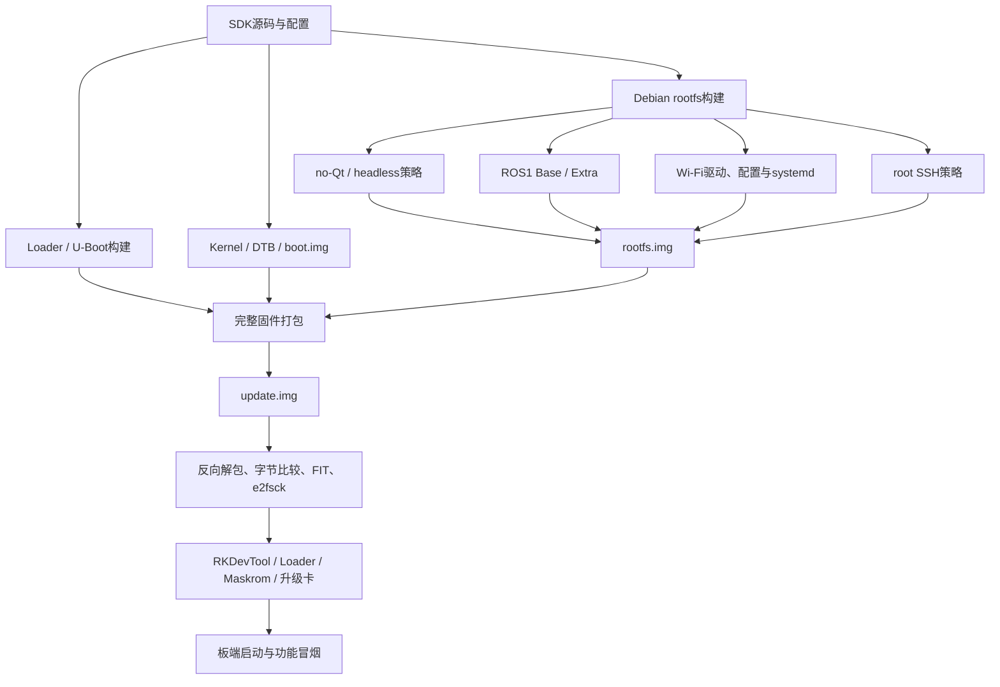

# RK3588 Debian 系统镜像工程技术文档

> 文档状态：基于 2026-07-30 前的 RK3588 SDK、rootfs、U-Boot、Wi-Fi、ROS1和完整固件验证资料整理。本文按具体构建产物分别标注硬件状态，不把不同版本的验证结论合并。

## 1. 文档目的

本文描述基于 RK3588 Linux SDK 构建定制 Debian 系统镜像的工程流程，主要包括：

- rootfs裁剪及no-Qt/headless策略；
- ROS1 Noetic Base/Extra集成；
- RTL8188EUS/RTL8188FU Wi-Fi驱动和启动服务；
- root SSH访问策略；
- U-Boot、Loader、boot和rootfs构建；
- 完整 `update.img` 的打包、反向解包和一致性验证；
- 真实板卡上的ROS、Wi-Fi、Camera、MPP和RTP冒烟测试；
- 构建、刷写和恢复过程中暴露的问题与工程约束。

本文的重点是“如何稳定地产生并验证一个可交付系统镜像”，不是单独介绍某个应用程序。

## 2. 项目背景与目标

厂家RK3588 Debian镜像包含较完整的桌面、Qt和示例组件，但目标设备更偏向无人系统计算节点，需要：

- 减少无关GUI和Qt运行时；
- 集成ROS1 Noetic及常用感知组件；
- 保留Rockchip V4L2、RGA、MPP和GStreamer能力；
- 支持USB Wi-Fi自动加载和联网；
- 提供可控的root运维入口；
- 能使用RKDevTool、Loader/Maskrom或升级卡交付完整固件；
- 对每个镜像保留哈希、文件系统UUID、分区内容和硬件运行证据。

项目不仅修改rootfs文件，还覆盖构建脚本、Debian overlay、内核模块布局、systemd服务、U-Boot依赖、固件打包和板端验收。

## 3. 系统分层



### 3.1 层级职责

| 层级 | 主要内容 |
| --- | --- |
| Boot链 | MiniLoader、U-Boot、ATF、OP-TEE、FIT、kernel和DTB |
| rootfs | Debian包、overlay、系统服务、ROS、网络、SSH和应用依赖 |
| 内核模块 | RTL8188EUS/8188FU等外部模块及版本化安装目录 |
| 固件包 | parameter、Loader、U-Boot、misc、boot、recovery、rootfs、OEM、userdata等 |
| 验证层 | SHA-256、UUID、SFI、反向解包、FIT、e2fsck和板端运行证据 |

## 4. 构建环境

| 项目 | 环境 |
| --- | --- |
| 目标平台 | TL3588 EVM / RK3588 |
| 目标系统 | Debian，Linux 5.10系列实时内核 |
| 构建主机 | Windows + WSL Ubuntu |
| SDK构建入口 | `./build.sh` |
| rootfs工具 | Debian构建脚本、chroot、ext4工具 |
| 固件工具 | `afptool`、`rkImageMaker`、`upgrade_tool`、RKDevTool |
| 板端验证 | 串口、SSH、systemd、V4L2、GStreamer、MPP、ROS |

构建过程涉及chroot、loop设备、文件所有权和sudo。任何自动化构建都必须确认sudo是否可非交互执行，避免任务停在密码提示且被误认为仍在编译。

## 5. rootfs裁剪策略

### 5.1 no-Qt与headless不是同一层级

项目中存在两个相关但不同的目标：

1. **no-Qt**：移除Qt GUI、Widgets、QML/Quick、Multimedia、Wayland/X11插件、GStreamer Qt、qv4l2和厂家Qt目录；其他GTK/XFCE组件可根据产品配置保留。
2. **headless**：在no-Qt基础上继续去除XFCE、LightDM、Xserver、Weston等桌面栈，只保留命令行、ROS和多媒体底层能力。

因此“没有Qt”不能自动等同于“没有桌面环境”，验收时应分别审计包、动态库、目录、profile和运行进程。

### 5.2 裁剪验证项

- `dpkg`状态中不包含目标Qt、QML和桌面包；
- 不存在 `/usr/lib/qt-*` 等厂家Qt目录；
- `libQt5*.so*`、Qt profile和桌面入口零命中；
- 不运行Qt、LightDM、Xserver或Weston进程；
- RGA、MPP、DRM、V4L2/media设备和Rockchip GStreamer插件仍存在；
- 移除GUI后没有误删ROS、网络和平台初始化依赖。

### 5.3 构建结果

标准rootfs构建能够输出约3.4—3.6 GB的ext4镜像。具体大小随ROS Extra、Wi-Fi模块、调试策略和文件系统预留空间变化，不能用文件大小单独判断版本。

每个交付镜像必须记录：

- 源码提交或分支；
- 构建选项；
- 文件长度；
- SHA-256；
- ext4 UUID；
- 离线审计结果；
- 是否已刷入真实板卡。

## 6. ROS1 Noetic集成

### 6.1 分层配置

ROS采用Base和Extra两档：

| 配置 | 内容 |
| --- | --- |
| Base | roscore、基础消息、常用ROS命令和运行时依赖 |
| Extra | `usb_cam`、`apriltag_ros`、`dynamic_reconfigure`、`nodelet`、`bond`、`camera_info_manager`、`image_geometry`等 |

默认构建Base；只有显式设置 `RK_DEBIAN_ENABLE_ROS1_EXTRA=y` 才构建Extra。

### 6.2 构建命令

```bash
set -o pipefail
./build.sh rootfs 2>&1 | tee build-ros1-base.log
```

Extra构建：

```bash
set -o pipefail
RK_DEBIAN_ENABLE_ROS1_EXTRA=y RK_DEBIAN_ROS1_EXTRA_JOBS=4 \
  ./build.sh rootfs 2>&1 | tee build-ros1-extra.log
```

### 6.3 离线验收

- 构建日志包含Base/Extra验证标志和 `build_rootfs rootfs succeeded`；
- `e2fsck -fn`五阶段通过；
- 必需ROS命令和Python导入通过；
- ELF扫描没有 `not found`；
- 构建工具不残留在最终镜像；
- `roscore`可以在隔离测试环境启动后干净退出；
- Qt、RViz、rqt和Gazebo不因ROS依赖被重新引入。

### 6.4 板端验收

真实板卡上至少执行：

1. 确认从预期rootfs分区和UUID启动；
2. 启动 `roscore`；
3. 启动临时publisher和subscriber；
4. 验证消息内容完全匹配；
5. 停止临时进程，确认没有残留；
6. 检查ext4、eMMC和systemd失败项。

已验证镜像中，ROS Noetic 1.17.4能够启动，真实pub/sub分别收到过 `board-ok`、`final-ok` 和后续恢复验证消息。

## 7. Wi-Fi驱动与网络启动

### 7.1 驱动集成

目标USB Wi-Fi模块使用RTL8188EUS/RTL8188FU系列驱动。集成要求：

- 模块针对目标内核版本构建；
- 安装到版本化 `/lib/modules/<kernel>` 目录；
- 生成depmod元数据；
- `modprobe -n`能够解析；
- 通过 `systemd-modules-load` 或专用服务自动加载；
- NetworkManager或项目脚本完成关联和DHCP。

仅把 `.ko` 平铺复制到 `/lib/modules` 或 `/vendor/lib/modules` 不足以证明冷启动自动加载可用。

### 7.2 Wi-Fi启动服务

Wi-Fi启动流程负责：

1. 检查模块是否存在并加载；
2. 读取持久化配置；
3. 验证配置不是空文件、全NUL或明显损坏；
4. 损坏配置移入隔离位置；
5. 回退到镜像内的有效默认配置；
6. 建立wlan0关联和DHCP；
7. 修复resolver链接；
8. 禁用未使用的hostapd，避免客户端和AP服务冲突；
9. 让NTP在网络可用后运行。

### 7.3 故障注入结果

一次板端故障中，持久化WPA文件变成244字节全NUL，服务累计重启19次。加入配置隔离和默认回退后，人工再次注入全NUL文件，系统能自动恢复；下一次重启约9.69秒完成联网，服务重启计数为0，网关3/3可达，当前启动没有ext4/MMC/I/O错误。

另一个独立RTL8188FU压力测试确认模块可在冷启动自动加载、NetworkManager自动连接并取得地址，但替换模块仍复现吞吐下降和可达性丢失。因此“驱动能够加载和联网”与“长期吞吐满足要求”应分开验收。

## 8. SSH访问策略

### 8.1 正常镜像

正常镜像使用root公钥登录：

- 只把公钥写入rootfs overlay；
- 私钥不得进入源码或镜像；
- `.ssh`目录权限为0700；
- `authorized_keys`权限为0600；
- root密码保持锁定；
- 禁止空密码登录。

公钥模式已在板端通过批处理SSH登录验证。

### 8.2 无认证root调试镜像

为了隔离网络调试，项目还提供显式开关：

```text
RK_DEBIAN_DEBUG_OPEN_ROOT_SSH=y
```

只有该变量打开时，构建才会解锁root空密码，并设置 `PermitRootLogin yes`、`PermitEmptyPasswords yes` 和 `UsePAM no`。默认构建策略不变。

该镜像等价于向所有可访问TCP/22的主机开放无认证root shell，只允许用于隔离可信局域网。交付目录必须携带醒目的不安全说明。

当前调试镜像已经完成：

- rootfs离线检查；
- 本机真实OpenSSH `none`认证测试；
- 完整固件反向解包和一致性验证。

但尚未刷入真实RK3588并从第二台计算机验证，因此不能标记为硬件通过。

## 9. U-Boot与Loader构建

### 9.1 源码和回滚基线

U-Boot主分支跟踪指定远端提交，同时保留厂家提交的tag和branch作为回滚引用。构建前应记录：

- 当前branch和HEAD；
- upstream；
- 厂家回滚提交；
- remote中是否意外保存认证信息。

### 9.2 Python 2依赖问题

SDK的FIT打包脚本仍依赖Python 2。第一次标准构建在 `pack_fit_image()` 处失败，Python 3.12不能直接运行该脚本。

解决方案是从官方源码把Python 2.7.18安装到用户专用目录，仅在U-Boot构建命令中临时加入PATH：

```bash
export PATH="$HOME/.local/python2.7.18/bin:$PATH"
./build.sh uboot 2>&1 | tee build-uboot.log
```

该方案不替换系统Python，也不改变其他构建任务的默认解释器。

### 9.3 构建验证

成功日志应包含 `build_uboot succeeded`。随后检查：

- FIT列出U-Boot、ATF、OP-TEE和U-Boot DTB；
- `output/firmware/uboot.img`和 `MiniLoaderAll.bin`链接到本轮新产物；
- 输出文件哈希已记录；
- 完整固件中引用的文件与构建结果逐字节一致。

当前新U-Boot及其完整固件已经通过离线门，但尚未在真实板卡验证新Boot链，因此其硬件状态仍为未验证。

## 10. 完整固件组成

项目生成的完整 `update.img` 通常包含10项：

| 项目 | 用途 |
| --- | --- |
| parameter | 分区定义和设备参数 |
| MiniLoader | DDR初始化和Loader入口 |
| U-Boot | 二级引导和FIT加载 |
| misc | 启动控制信息 |
| boot | kernel、DTB和resource FIT |
| recovery | 恢复环境 |
| rootfs | 定制Debian ext4系统 |
| OEM | 厂家或产品OEM数据 |
| userdata | 用户数据和预置部署内容 |
| 其他支持项 | 由具体parameter和厂家包定义 |

不同版本的厂家支持链可能对条目名称和镜像要求略有差异，打包时必须以同一版本的parameter、Loader和支持镜像为基线，不能随意混用。

## 11. 固件打包与验证流水线


### 11.1 离线验收门

完整包在交付前至少满足：

- `upgrade_tool SFI`识别目标SoC、Loader版本和预期条目数；
- 外层和内层均可反向解包；
- 每个解包条目与输入镜像逐字节一致；
- boot和U-Boot FIT可读取，内嵌哈希匹配；
- 解包后的rootfs通过 `e2fsck -fn`；
- ext4内包、服务、权限、符号链接和配置符合构建策略；
- Windows交付副本与SDK产物哈希一致。

### 11.2 硬件验收门

- 串口日志显示预期SPL、U-Boot、BL31、OP-TEE和kernel路径；
- kernel命令行指向预期rootfs分区；
- 板端rootfs UUID与目标镜像一致；
- 当前启动无ext4、MMC或I/O错误；
- no-Qt/headless审计与离线结果一致；
- ROS、Wi-Fi、Camera、MPP和RTP按该版本的验收范围通过；
- 临时测试进程和配置已清理。

离线门通过不能替代硬件门。尤其是新U-Boot、调试SSH和后续Wi-Fi修复镜像，需要分别记录是否真正刷入。

## 12. 刷写与恢复方式

### 12.1 RKDevTool Loader/Maskrom

USB Loader或Maskrom用于完整固件刷写和严重损坏恢复。写入前必须核对：

- Windows枚举的Rockchip设备模式；
- 目标板型号；
- update.img的完整SHA-256；
- 本轮操作是完整升级还是单分区写入；
- 是否会覆盖userdata。

### 12.2 SD启动卡与固件升级卡

厂家工具存在不同模式：

- **SD启动**：目标是在SD卡上形成可启动系统；
- **固件升级**：从SD介质启动后写入eMMC。

两者影响范围不同，不能混用。parameter对介质原始容量有要求，容量不足或已有卡内镜像哈希不一致时必须拒绝制卡。

### 12.3 单分区写入

boot通常位于p3，rootfs通常位于p6。执行单分区写入时必须同时核对文件类型、目标分区和预计UUID。

曾发生把 `boot.img`误写入rootfs分区的事件，导致p6开头ext4被覆盖、系统无法进入用户空间。恢复必须通过Loader/Maskrom或厂家完整镜像，禁止在正在挂载的rootfs上直接覆盖或运行修复写操作。

## 13. 真实板卡验证结果

### 13.1 no-Qt与ROS镜像

已在真实RK3588上确认：

- 从预期eMMC rootfs分区启动；
- Qt包、库、目录和运行时进程零命中；
- ROS1 Base和Extra存在；
- `roscore`启动成功；
- publisher/subscriber消息闭环通过；
- RGA、MPP、DRM、V4L2和media节点存在；
- 没有当前启动的ext4/MMC错误。

### 13.2 Camera与RTP冒烟

在特定已验收镜像上完成：

- IMX415识别成功；
- 3840×2160 NV12采集10帧；
- MPP H.265编码30帧，返回0；
- 后续完整场景完成20秒或30秒RTP/UDP 5600传输；
- 一次8秒主机统计接收约3.56 MB；
- 临时管道退出后清理测试进程。

这些结果验证特定镜像、板卡和Camera链路，不代表所有后续rootfs或不同摄像头硬件自动继承结论。

### 13.3 Wi-Fi恢复

匹配驱动能够加载并扫描网络。加入配置恢复逻辑后，损坏WPA配置可被隔离并回退，重启后自动连接和DHCP通过，网关无丢包。

吞吐长期稳定性仍受具体USB模块、AP环境和驱动数据路径影响，需要独立压力测试。

## 14. 产物状态分离

| 产物类别 | 离线验证 | 硬件状态 |
| --- | --- | --- |
| 2026-07-21 no-Qt/ROS/Camera/RTP验收镜像 | 通过 | 已通过定义范围的硬件冒烟 |
| 含Wi-Fi损坏配置恢复的新候选rootfs | 通过 | 部分逻辑已板端热修复验证，精确重建镜像仍需单独刷写确认 |
| 新U-Boot main完整固件 | SFI、反向解包、FIT、e2fsck通过 | 未验证新Boot链 |
| 无认证root SSH调试完整固件 | rootfs、真实本机SSH、完整包离线门通过 | 未在真实板卡和第二台客户端验证 |

文档、测试报告和发布清单必须引用具体产物的SHA-256及UUID，不能用“最新版”代替。

## 15. 典型故障与复盘

### 15.1 内核模块平铺导致自动加载失败

现象：rootfs能启动，但目标内核版本目录不存在，Wi-Fi模块无法通过标准机制解析。

根因：模块仅被复制到平铺目录，没有匹配kernel release的版本化布局和depmod数据。

修复：在构建hook中安装到版本化目录，建立兼容链接并运行depmod；增加 `modprobe -n` 和板端冷启动检查。

### 15.2 构建主机resolver进入目标镜像

现象：镜像刷入后带有WSL环境的 `/etc/resolv.conf`，板端DNS异常。

根因：rootfs构建/chroot阶段没有在退出前恢复目标系统resolver语义。

修复：使用resolvconf管理的运行时符号链接，并把静态检查加入镜像审计。

经验：构建主机的临时挂载、DNS和认证材料都可能泄漏到目标rootfs，必须执行host contamination审计。

### 15.3 Wi-Fi unit未进入已刷镜像

现象：源码和板端热修复均存在Wi-Fi服务，但实际活动rootfs没有unit。

根因：构建产物、Windows候选和板端实际刷入版本不一致。

修复：以rootfs UUID和SHA-256确认活动版本，不再仅凭文件名或操作口头记录判断刷写成功。

### 15.4 持久化WPA配置全NUL

现象：Wi-Fi服务持续重启，无法关联。

根因：持久配置文件长度看似正常但内容全部为NUL，原脚本只检查“文件存在”。

修复：校验配置内容，异常文件隔离保存，回退镜像默认配置，并执行故障注入和重启验证。

### 15.5 boot.img误写rootfs

现象：Boot链仍能加载kernel，但rootfs无法挂载并进入用户空间。

根因：单分区操作中镜像类型和分区目标未形成强校验门。

修复：通过厂家完整固件恢复；后续要求写前显示目标分区、镜像类型、大小、哈希和预期UUID。

### 15.6 U-Boot构建依赖旧Python

现象：SPL/TPL完成后在FIT打包阶段提示缺少Python 2。

根因：厂家脚本没有迁移到Python 3。

修复：把Python 2.7.18隔离安装到用户目录，只为U-Boot构建临时修改PATH，不污染系统Python。

## 16. 配置与安全原则

1. 默认构建不得开放无认证root SSH。
2. 私钥、Wi-Fi密码、设备IP和内部认证信息不得写入公开文档或源码。
3. 每个镜像必须有不可变哈希和UUID，不使用含糊的“新包”“最终版”名称。
4. 生产与调试构建选项必须显式分离，并让风险说明跟随产物。
5. 完整升级可能覆盖userdata，操作前必须备份并确认范围。
6. 禁止在已挂载rootfs上执行会修改文件系统结构的e2fsck或覆盖写入。
7. 出现ext4目录校验、MMC读写或介质掉线时，应先停止功能验收并恢复存储健康。

## 17. 后续工作

1. 为各构建配置建立机器可读manifest，记录提交、选项、哈希、UUID和验证状态。
2. 把rootfs、U-Boot、boot和完整包验证脚本整合为单一发布门。
3. 在真实板卡验证新U-Boot main完整固件的串口Boot链和Linux启动。
4. 刷写并验证包含Wi-Fi恢复逻辑的精确重建rootfs，而不是只验证板端热修复。
5. 在隔离网络验证无认证root SSH镜像，并建立自动销毁或回滚流程。
6. 对Wi-Fi执行吞吐、断电、USB重枚举和长时间稳定性测试。
7. 分开维护Camera、GMAC/UART冲突、Docker和MAVROS等平台子项目的验收矩阵。
8. 为单分区写入工具增加镜像类型、分区名、大小和UUID的强制确认。

## 18. 原始资料索引

主要本地目录：

- `D:\WORK\RK3588\rk3588_sdk_work_rootfs`
- `D:\WORK\RK3588\rtl8188ftv`
- `D:\WORK\RK3588\RK3588_IMX415_Archive_20260512`
- `D:\WORK\patch-kernel`
- `D:\WORK\sdcard`

重点资料：

- `rk3588_sdk_work_rootfs/docs/project-status.md`
- `rk3588_sdk_work_rootfs/docs/verification/rootfs-noqt-bringup.md`
- `rk3588_sdk_work_rootfs/docs/verification/rootfs-ros1-bringup.md`
- `rk3588_sdk_work_rootfs/docs/verification/uboot-weilai-main-build.md`
- `rk3588_sdk_work_rootfs/docs/evidence/2026-07-30-debug-open-root-ssh-update-image.md`
- `rk3588_sdk_work_rootfs/docs/decisions/2026-07-30-debug-open-root-ssh-policy.md`
- `rtl8188ftv/docs/project-status.md`
- `rtl8188ftv/docs/evidence/2026-07-17-rtl8188fu-max-throughput.md`
- `patch-kernel/0001-arm64-dts-add-tl3588-tritrong-three-camera-config.patch`
- `patch-kernel/0002-arm64-dts-update-tritrong-CAN-clock-and-front-cam-de.patch`
- `patch-kernel/0003-media-i2c-imx415-add-4-lane-high-fps-modes.patch`

原始工程记录含网络地址、Wi-Fi配置、SSH信息、内部仓库和固件交付路径。对外分享前必须进行内容级脱敏，不能只删除文件名。
