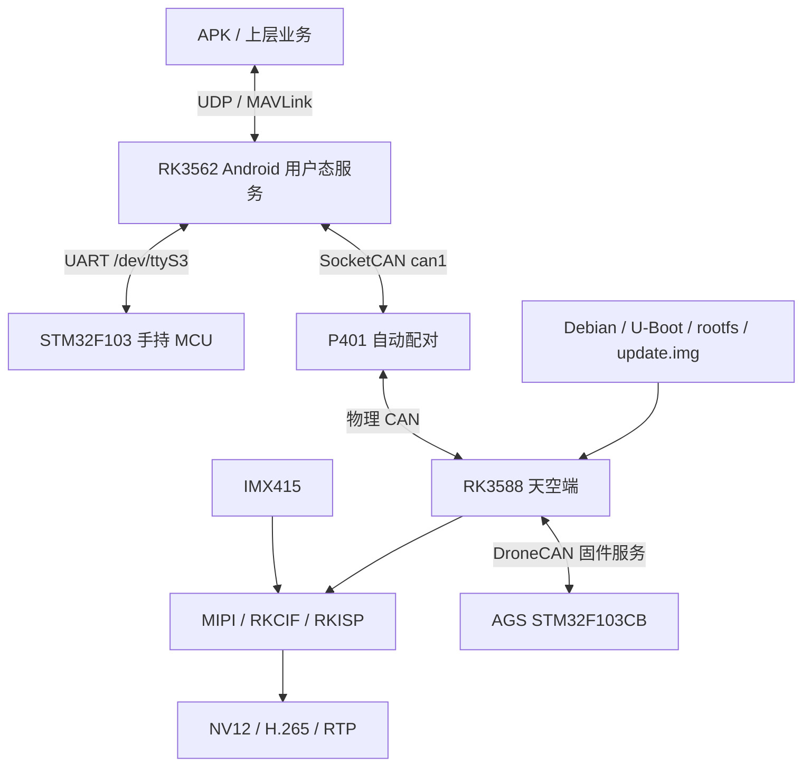
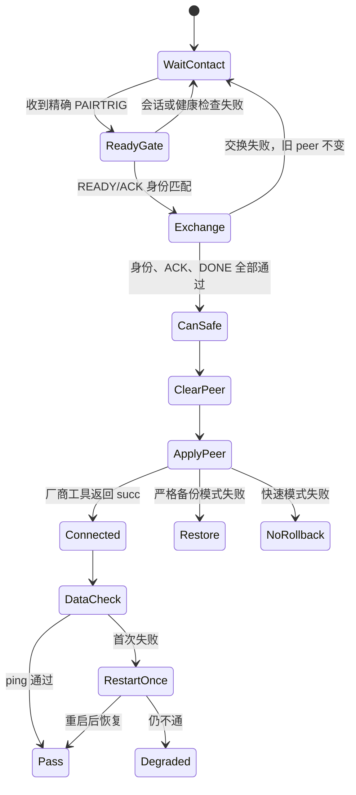
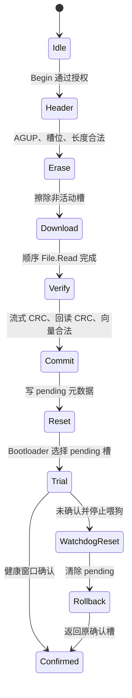

# 嵌入式软件实习转正答辩｜技术详版

> 用途：转正答辩技术底稿、评委追问准备和项目复盘。
> 表达原则：区分“主要负责/参与”“实现/验证”“离线通过/硬件通过”“台架闭环/生产可用”。
> 保密原则：本文不记录真实设备身份、账号、密钥、Wi-Fi 信息、内网地址和公司源码内容。

## 1. 实习工作定位

实习工作围绕无人系统手持终端和板载计算节点展开，覆盖四个相互连接的技术层：

1. **MCU 实时控制层**：按键、电源、电量、传感器、看门狗和 Bootloader。
2. **设备通信层**：UART、CAN、DroneCAN、MAVLink、UDP/UDS 和多端状态机。
3. **Linux/Android 平台层**：板端服务、Camera、系统服务、rootfs 和完整镜像。
4. **验证与交付层**：主机测试、板端日志、总线抓包、硬件测量、哈希/UUID 和恢复流程。

我的主要负责范围集中在 STM32 MCU 固件、RK-MCU 协议和固件升级；RK3562/RK3588 用户态服务、P401 自动配对、Camera 和系统镜像属于具体模块实现、适配或联调，不将整个 Android/Linux 系统表述为个人独立完成。



## 2. 技术栈与应用场景

| 技术 | 为什么使用 | 项目应用 | 主要验证方法 |
| --- | --- | --- | --- |
| C / FreeRTOS | 资源受限、实时任务和外设控制 | 手持 MCU、电源状态机、AGS MCU | 串口日志、任务行为、真机输入输出 |
| UART + TLV + CRC | MCU 与 SoC 之间低成本、可扩展通信 | RK-MCU 状态与命令、UART-IAP | 半包/粘包、CRC 错误、ACK、串口抓取 |
| CAN / SocketCAN | 多节点、强抗干扰、硬件仲裁 | P401 身份交换、AGS 在线升级 | `ip -details link`、candump、cansend、错误计数 |
| DroneCAN | 复用节点、服务和文件读取语义 | AGS `BeginFirmwareUpdate/File.Read` | NodeStatus、请求数量、服务响应、CAN 健康 |
| UDP / UDS / `poll` | 板内和网络多端点低开销通信 | CommRouter、APK、P401、外设事件 | tcpdump、端口抓包、进程日志、路由矩阵 |
| V4L2 / Device Tree | Linux Camera 标准接口与硬件拓扑描述 | IMX415 1080p60 | media graph、RAW/NV12 抓帧、controls 对比 |
| systemd / Android init | 服务自启动、依赖和失败恢复 | P401、Camera guard、Wi-Fi、板端 daemon | 服务状态、启动日志、重启和故障注入 |
| U-Boot / rootfs / ext4 | 构建完整可启动系统 | RK3588 Debian 镜像 | FIT、e2fsck、SHA-256、UUID、串口 Boot 链 |

## 3. 项目一：RK3562 + STM32F103 手持发射器

### 3.1 项目背景与系统分工

手持设备由 RK3562 Android 主控和 STM32F103RCT6 控制 MCU 组成：

- STM32 处理按键、电源、电量、充电、传感器、看门狗和底层状态；
- RK3562 运行 Android、APK、板端服务和网络链路；
- 两端通过 USART2 与 `/dev/ttyS3` 通信；
- RK3562 还连接 P401 TUN、`can1`、本地 input/GPIO 和 APK UDP。

```text
APK / P401 / 网络
        |
CommRouter / PeripheralManager / LinkController
        |
UDP / UDS / UART / SocketCAN / input
        |
STM32F103：电源、按键、电量、传感器、协议、Bootloader
```

### 3.2 MCU 电源与按键状态机

状态机必须处理按键动作、系统电源状态和 RK 关机过程，不能使用“检测到按下就翻转状态”的简单逻辑。

关键时序：

| 参数 | 当前值 | 作用 |
| --- | ---: | --- |
| 按键去抖 | 50 ms | 过滤机械抖动 |
| 短按上限 | 500 ms | 区分短按和长按 |
| 长按关机 | 2 s | 触发开机态关机流程 |
| 手势窗口 | 3 s | 限制组合动作识别窗口 |
| RK `PWRON` 短脉冲 | 250 ms | 配合 RK 唤醒或电源动作 |
| RK 关机长按模拟 | 6 s | 给 RK809/PWRON 完整关机语义 |

主要状态与动作：

- 关机态短按：仅显示电量，不上电；
- 关机态长按：电量和外部供电条件满足后上电；
- 开机态短按：显示当前电量；
- 开机态长按：先向 RK 发出 PWRON 行为，再进入关机流程；
- 低电状态：拒绝上电，并通过最低电量 LED 快闪提示；
- 软关机状态：抑制重复业务日志和非必要动作，避免被误认为仍正常运行。

设计要点：状态转换由“当前状态 + 输入事件 + 持续时间 + 电源条件”共同决定；长按动作只触发一次，按键释放后才重新布防。

### 3.3 电量和充电显示

MCU 使用 PB1/`Vbus_ADC` 采样估算电量，通过四颗 LED 显示区间，并结合 CH224 充电检测实现下一格闪烁。

| 项目 | 当前参数 |
| --- | --- |
| ADC | 3.3 V、12 bit、满量程 4095 |
| 经验映射 | raw `2792 → 0%`，`3392 → 100%` |
| 采样周期 | 1 s |
| 运行日志 | 5 s |
| 充电闪烁 | 500 ms |
| 短按显示 | 5 s |
| 低电提示 | 2 s |
| 快闪半周期 | 100 ms |
| 低电进入/退出 | 1% / 10% |

电量档位变化需要持续满足条件后才接受，避免 ADC 波动导致 LED 来回跳变。现有百分比属于经验映射，不等同基于电池曲线、温度和负载补偿的严格 SOC 估算。

源码中预留的 7.1 V 电压保护开关当前关闭，答辩时不能把它描述为已完成硬件验证的低压保护功能。

### 3.4 RK-MCU 运行时 UART 协议

帧格式：

```text
SOF      1 B   固定 0xA5
type     1 B   消息类型
seq      1 B   帧序号
len      1 B   payload 长度
payload  N B   公共头 + TLV，最大 128 B
crc16    2 B   CRC16-CCITT，小端
```

payload 公共信息可包含版本、flags、`request_id`、运行时间和 TLV 列表。主要消息包括：

| 消息 | type | 用途 |
| --- | ---: | --- |
| HELLO | `0x00` | 端点识别和基础信息 |
| PING | `0x01` | 存活检查 |
| STATUS | `0x02` | 电源、电量、充电、IWDG 等摘要 |
| GPS | `0x04` | GPS 状态 |
| COMMAND | `0x08` | RK 下发命令 |
| ACK/ERROR | `0x0B` | 命令结果 |

`ENTER_BOOTLOADER` 命令 ID 为 5。MCU 接收后先返回结果，再设置升级请求并复位，避免 RK 在 ACK 发出前失去串口连接。

为什么选择 TLV：

- 避免直接发送 C 结构体带来的对齐和 ABI 问题；
- 可以新增字段而不改变旧字段位置；
- 旧端可以跳过未知 type；
- 配合 `seq/request_id` 区分帧顺序与业务请求；
- CRC 负责发现传输损坏，ACK 负责确认业务执行，两者作用不同。

接收侧使用状态机解析字节流，处理半包、粘包、非法长度、CRC 错误和重新同步。接收队列为 128 B，每次 poll 最多处理 64 B；HELLO、STATUS 和 GPS 默认各 1 Hz。

### 3.5 UART-IAP Bootloader

历史单槽布局：

| 区域 | 起始地址 | 说明 |
| --- | ---: | --- |
| Bootloader | `0x08000000` | 独立启动和升级程序 |
| APP | `0x08004000` | 偏移 16 KiB 链接 |

RK 通过 `/dev/ttyS3`、`115200 8N1` 发送 `IAP1` 和 16 字节小端头：

```text
magic: IAP1
size
crc32
base
reserved = 0
```

Bootloader 检查 base、size、reserved 和写入范围；接收完成后计算标准 reflected CRC32。APP 合法性检查包括：

- MSP 必须位于合法 SRAM 范围并满足对齐；
- Reset Handler 必须位于 APP Flash 范围；
- Reset Handler 的 Thumb bit 必须有效；
- 跳转前关闭 SysTick/NVIC，设置 `SCB->VTOR` 和 MSP，再跳转 Reset Handler。

单槽方案采用“首 APP 页延后写入”：先缓存首页、写后续页，整包校验通过后再让向量表生效。它可以降低不完整镜像被启动的概率，但不能替代 A/B 分区，也不能对任意断电点提供绝对恢复保证。

当前扩展 A/B 版本使用 16 KiB Bootloader、两个 118 KiB slot 和两页 metadata，已完成构建与主机校验，但仍标记为未完成 A/B 真机闭环；答辩时必须与 AGS 已完成 10 轮硬件升级的 A/B 方案区分。

### 3.6 RK3562 用户态服务

`CommRouter` 的职责是统一接收多个 fd，根据来源执行 MAVLink 路由：

| 来源 | 典型去向 |
| --- | --- |
| APK UDP | P401 |
| P401 TUN UDP | APK |
| UART telemetry | APK |
| LocalButton / LocalCan | APK + P401 |

使用 `poll` 的原因是端点数量有限、消息处理短小、共享路由状态较多，单事件循环比为每个端点创建线程更容易控制顺序和资源。需要确保每轮遍历 `revents`、处理错误/挂断，并限制单 fd 的处理量，防止高流量端点饿死其他链路。

`PeripheralManager` 读取 `/dev/input/eventX`，完成去抖和长短按识别，根据 JSON 配置构造 MAVLink `COMMAND_LONG`，再通过 UDS 发给 `CommRouter`；同时承载部分 CAN pairing 事件。

职责边界：我参与服务模块和链路联调，能够解释数据流、端点和排查方法，但不把完整 Android BSP、APK 和全部 daemon 描述为独立完成。

### 3.7 典型追问

**问：CRC 通过为什么还需要 ACK？**

CRC 只说明收到的字节与发送端计算一致，不能说明命令已执行。ACK 需要携带请求标识和结果，表达业务层处理状态。

**问：UART 中间丢一个字节怎么办？**

解析器发现长度或 CRC 异常后丢弃当前候选帧，继续搜索下一个 `0xA5`。还要限制最大长度，防止错误 len 让解析器长期等待。

**问：单槽 IAP 能否保证断电不变砖？**

不能绝对保证。独立 Bootloader、合法性检查和延后写首页降低风险；要进一步保护已确认镜像，应使用经过硬件验证的 A/B、双元数据和回滚方案。

## 4. 项目二：P401 CAN 自动配对

### 4.1 业务问题

P401 的地面 AP 和天空 DEV 需要配置对端四字节身份。传统方式要分别登录设备、查询身份和调用厂商工具，容易写错或遗漏。项目利用两端接触时已有的 CAN 链路完成身份发现和确认，再写入 P401 peer。

CAN 仅用于控制面；配对后的业务数据仍走 P401 TUN。必须区分：

1. CAN 控制器发送成功；
2. 对端应用解析成功；
3. 身份交换状态机成功；
4. 厂商工具写入成功；
5. P401 TUN 数据面恢复。

### 4.2 身份与协议约束

权威身份来自厂商 `wire_pair --get-local-mac` 的四字节结果，不使用 TUN、USB 或普通网卡 MAC 代替。

身份载荷：

```text
00 00 ID0 ID1 ID2 ID3 01 C0
```

READY、Report、ACK 和 DONE 阶段必须携带匹配身份。地面约 10 Hz 发送：

```text
CAN ID:  07200702
Payload: 50 41 49 52 54 52 49 47   # ASCII PAIRTRIG
```

天空回复 READY，地面只有确认 READY 中的天空身份与当前会话一致后才回复 READY_ACK。当前八帧流程在基础六帧身份交换后增加 DONE/DONE_ACK，避免一端收到最后 ACK 后单方面假定对端已经完成。

### 4.3 状态机与写入安全



关键不变量：身份交换结束前不得清除旧 peer；CAN 断开后提交只能使用已经缓存并确认的身份；失败结果必须说明是否已经发送 CAN、是否已经写 P401、是否存在备份。

快速模式 `BACKUP_ENABLE=0` 可以缩短成功路径，但 clear 后 commit 失败会进入 `FAIL_NO_ROLLBACK`。严格模式在清除前备份旧值并尽力恢复，但仍不是跨两端事务。

### 4.4 验证状态

基础六帧版本已在真实双板完成：

- 两端 CAN 为 500 kbit/s、normal、`ERROR-ACTIVE`；
- 双方输出 `PASS_EXCHANGE`；
- 厂商工具返回 `succ` 和 `PASS_COMMIT`；
- 运行时与持久化 peer 读回正确；
- TUN 双向各 3 个 ICMP 包通过，丢包率 0%；
- CAN Error-Warning、Error-Passive 和 Bus-Off 计数保持 0。

最新八帧自动版本已完成离线 mock 和安全部署，但尚未形成健康接触下的完整硬件多轮证据，因此不能声明“稳定小于 3 秒”或已经完成 P50/P95 时延验证。

### 4.5 典型追问

**问：CAN 自带 ACK，为什么还设计 READY_ACK 和身份 ACK？**

CAN ACK 是链路层确认，只能说明总线上有节点正确接收位流；应用 ACK 才能确认目标进程解析了当前会话和具体身份。

**问：为什么自动模式失败后不强制把 CAN down？**

CAN 接口由既有系统服务管理，自动配对模块不拥有其生命周期。短暂超时不应扩大成全系统通信中断；严格诊断工具才允许显式 down。

**问：为什么八帧比六帧更可靠？**

DONE/DONE_ACK 让双方明确知道对端已经缓存并确认身份，避免最后 ACK 单帧丢失或进程退出造成单边成功。

## 5. 项目三：RK3588 IMX415 Camera bring-up

### 5.1 Camera 数据链路

```text
I2C 配置寄存器
        |
IMX415 --RAW10/MIPI CSI-2--> DPHY --> CSI2 --> RKCIF --> RKISP
                                                     |       |
                                                   RAW     NV12
                                                             |
                                                        MPP H.265
                                                             |
                                                         RTP/UDP
```

- I2C 负责配置 sensor 寄存器，不承载图像数据；
- MIPI CSI-2 传输 RAW10 像素；
- RKCIF 接收和落地前端数据；
- RKISP 完成 Bayer、曝光/增益相关处理和格式转换；
- NV12 用于编码、显示和图传。

Sensor probe 成功只证明 I2C、供电、时钟和驱动匹配达到基本条件，不代表 MIPI、media graph、ISP 和最终视频节点全部正常。

### 5.2 1080p60 模式适配

工作基于现有 IMX415 V4L2 sensor driver，不是从零开发。适配项包括：

- mode table 和 sensor 寄存器表；
- `1920×1080` 输出窗口；
- HTS、VTS 和曝光上限；
- `vertical_blanking`；
- `pixel_rate` 与 `link_frequency`；
- MIPI lane 数和设备树 endpoint；
- 驱动 bus format 与实际 Bayer 相位。

当前稳定 timing：

```text
VTS = 0x08CA = 2250
height = 1080
vertical_blanking = VTS - height = 1170
稳定 controls：vblank=1170, exposure=676, analogue_gain=80
```

帧率不是单一字段。理论上由像素时钟、HTS 和 VTS 共同决定；同时还要保证 MIPI lane 带宽、寄存器表和驱动声明一致。

### 5.3 Device Tree 与 media graph

设备树主要核对：

- I2C bus 和 sensor 地址；
- MCLK 频率与来源；
- reset/power GPIO 极性和时序；
- MIPI data lanes；
- sensor、DPHY、CSI2、RKCIF 和 RKISP 的 remote endpoint；
- 节点 status 和 pinctrl。

调试工具分工：

| 工具 | 主要用途 |
| --- | --- |
| dmesg | probe、时钟、GPIO、MIPI/CSI/ISP 错误 |
| `media-ctl -p` | 查看实体、pad、link 和格式 |
| `v4l2-ctl --all` | 查看 controls、格式和帧率 |
| `v4l2-ctl --stream-*` | RAW/NV12 抓帧和帧数统计 |
| GStreamer | 编码前后和 RTP 图传冒烟 |
| 测试源 | 排除编码、网络和接收端问题 |

### 5.4 黑帧问题定位

现象：`/dev/video0` RAW 有有效数据，而 `/dev/video11` NV12 的 Y 平面接近 0、UV 约 128，表现为黑帧。

排查过程：

1. 用测试源验证 H.265、RTP、网络和接收端；
2. 抓 RAW，确认 sensor、MIPI 和 RKCIF 主链路基本可用；
3. 抓 NV12，确认异常位于 ISP/AIQ 范围；
4. 对比 `rkaiq_3A` 启停前后的 V4L2 controls；
5. 发现 AIQ 将 vblank 从稳定值 1170 改为 46；
6. 禁用不匹配 AIQ，并通过 systemd guard 固定已验证 controls；
7. 重新执行 RAW/NV12 帧数和非零数据检查。

工程规避能够恢复输出，但长期正确方案是提供与 1080p60 linear mode 匹配的 IQ 文件，并评估驱动侧 controls 约束。不能把当前工作描述为“解决了完整 3A 算法”。

### 5.5 色差问题

更换摄像头方位后出现明显色差。使用测试源排除编码和接收端，再结合 RAW 特征、media graph 和驱动 bus format 判断 Bayer 相位不匹配。修正 `MEDIA_BUS_FMT_*` 后恢复正常颜色。

这个问题说明“能够出图”不等于像素语义正确；翻转、镜像、模组安装方向和驱动 Bayer 声明必须保持一致。

### 5.6 验证结果与边界

- `1920×1080@60fps` RAW10 为目标模式；
- RAW `/dev/video0` 600 帧通过；
- ISP/NV12 `/dev/video11` 600 帧通过；
- 指定镜像完成 MPP H.265 和 RTP/UDP 5600 冒烟；
- 1080p90 只做过探索，出现 CSI/MIPI 错误，不作为完成项；
- AIQ/IQ 的长期匹配仍需继续完善。

### 5.7 典型追问

**问：RAW 正常为什么可以缩小问题范围？**

RAW 有效说明 sensor 配置、MIPI 和前端采集大体成立；NV12 由 ISP 产生，因此问题更可能位于 ISP 配置、AIQ controls 或格式处理，但仍要结合错误计数排除偶发 MIPI 问题。

**问：vblank 为什么影响曝光和帧率？**

VTS 等于有效高度加 vblank。曝光行数通常不能超过 VTS 的安全范围；修改 vblank 会改变帧周期和曝光上限，不匹配的 controls 可能让 sensor 与 ISP 的时序假设失效。

## 6. 项目四：RK3588 Debian 系统镜像工程

### 6.1 目标与分层

目标不是生成一个“能启动的 rootfs”，而是稳定产生可追溯、可刷写和可验收的完整系统：

```text
SDK / 配置
  ├─ Loader / U-Boot / ATF / OP-TEE
  ├─ kernel / DTB / boot.img
  └─ Debian rootfs
       ├─ no-Qt / headless 策略
       ├─ ROS1 Base / Extra
       ├─ Wi-Fi 驱动与服务
       └─ SSH / 网络 / 应用依赖
                ↓
parameter + loader + uboot + boot + rootfs + recovery + OEM + userdata
                ↓
             update.img
```

构建环境为 Windows + WSL Ubuntu，目标为 RK3588 Debian 和 Linux 5.10 系列内核。构建涉及 chroot、loop、所有权和 sudo，因此日志必须能区分真正编译与等待密码提示。

### 6.2 rootfs 裁剪与 ROS

no-Qt 与 headless 不是同一概念：

- no-Qt 重点移除 Qt Widgets、QML、插件和厂家 Qt 目录；
- headless 还要进一步移除 XFCE、LightDM、Xserver、Weston 等桌面栈。

裁剪后仍需保留 RGA、MPP、DRM、V4L2/media 和 Rockchip GStreamer 能力。rootfs 常见大小约 3.4—3.6 GB，大小随 ROS、模块和预留空间变化，不能仅凭体积判断版本或裁剪效果。

ROS1 Noetic 分 Base 和 Extra；板端验收使用真实 publisher/subscriber 验证消息闭环，并检查测试进程能干净退出。指定镜像已完成 ROS Noetic 1.17.4 的启动和 pub/sub。

### 6.3 Wi-Fi 驱动与恢复

RTL8188EUS/RTL8188FU 模块必须安装到 `/lib/modules/<kernel release>` 的版本化目录并生成 depmod 数据，仅平铺复制 `.ko` 不能证明冷启动自动加载。

Wi-Fi 服务负责模块加载、配置校验、关联、DHCP、resolver 修复和服务冲突处理。曾遇到持久化 WPA 文件变为 244 字节全 NUL，旧服务只检查文件存在，导致累计重启 19 次。修复后加入内容校验、异常文件隔离和默认配置回退；再次故障注入后，重启约 9.69 秒完成联网，服务重启计数为 0，网关 3/3 可达。

“驱动能够加载和联网”与“长期吞吐稳定”是两套验收。当前证据显示不同方向吞吐存在差异，不能宣称 TCP/UDP 均稳定超过某个统一指标。

### 6.4 U-Boot 和完整固件

SDK 的 FIT 打包脚本依赖 Python 2。解决方式是将 Python 2.7.18 隔离安装到用户目录，仅在 U-Boot 构建命令中临时加入 PATH，避免替换系统 Python。

完整固件发布门：

1. 记录源提交、构建选项和输入 SHA-256；
2. 使用 `afptool`、`rkImageMaker` 生成 `update.img`；
3. `upgrade_tool SFI` 识别 SoC、Loader 和条目；
4. 双层反向解包；
5. 解包项与输入镜像逐字节比较；
6. 检查 boot/U-Boot FIT 结构和哈希；
7. rootfs 执行 `e2fsck -fn`；
8. Windows 交付副本再次校验；
9. 真机核对 Boot 链、分区、UUID 和功能冒烟。

文件名和修改时间不能证明板端运行版本。应使用 SHA-256、ext4 UUID、实际挂载分区和串口日志建立产物身份。

### 6.5 典型故障复盘

- **模块平铺**：缺少版本化目录和 depmod，冷启动无法标准加载；修复为构建 hook 安装和 `modprobe -n` 检查。
- **主机污染**：WSL 的 resolver 进入目标 rootfs；修复为恢复运行时符号链接并增加 host contamination 审计。
- **版本错位**：源码有 Wi-Fi unit，但已刷 rootfs 没有；改用 UUID 和哈希确认活动版本。
- **误写分区**：曾把 `boot.img` 写入 rootfs 分区，导致 ext4 头被覆盖；后续增加镜像类型、目标分区、大小、哈希和 UUID 写前确认。
- **新 U-Boot 仅离线通过**：FIT、反向解包和 e2fsck 通过不等于新 Boot 链已在真机验证。

## 7. 项目五：AGS STM32F103CB DroneCAN A/B 升级

### 7.1 项目目标与安全边界

AGS 控制板由 RK3588 和 STM32F103CB 组成。早期 MCU 更新依赖 SWD；项目目标是在保留恢复能力的前提下，由 RK 通过 CAN 在线更新 MCU。

核心安全目标：

- 运行镜像不能覆盖自身或已确认镜像；
- 新镜像完整下载并校验后才能试运行；
- 未在健康窗口确认时回滚；
- 元数据提交中断后仍保留上一条有效记录；
- RK 必须同时确认下载、复位、恢复运行和 CAN 健康；
- 默认构建拒绝升级，台架模式需要 `AB_UPDATE_BENCH_ALLOW=1`。

当前方案使用 CRC32 检测传输和存储损坏，但没有数字签名、可信密钥、硬件兼容证书和反回滚计数，因此定位为台架方案。

### 7.2 Flash 布局

| 区域 | 起始地址 | 大小 |
| --- | ---: | ---: |
| Bootloader | `0x08000000` | 16 KiB |
| Slot A | `0x08004000` | 52 KiB |
| Slot B | `0x08011000` | 52 KiB |
| Reserved | `0x0801E000` | 6 KiB |
| Metadata 0 | `0x0801F800` | 1 KiB |
| Metadata 1 | `0x0801FC00` | 1 KiB |

APP 必须针对 A/B 地址分别链接。运行 APP 只允许擦写非活动槽。

双 metadata 页使用 magic、序号和 CRC 选择最新有效记录；新记录写入另一页，有效标志最后提交。记录包含确认槽、pending 槽、镜像版本、剩余试运行次数和序号。该设计降低元数据中断风险，但仍需要真实逐点断电矩阵证明。

### 7.3 AGUP 包与打包检查

AGUP 由 32 字节小端头和目标槽 APP BIN 组成：

| 偏移 | 字段 | 说明 |
| ---: | --- | --- |
| 0 | `AGUP` | Magic |
| 4 | Format Version | 当前 1 |
| 6 | Header Size | 32 |
| 8 | Target Slot | A=0，B=1 |
| 12 | Image Length | 最大 52 KiB |
| 16 | Image CRC32 | 镜像完整性 |
| 20 | Image Version | 版本记录 |
| 24 | Flags | 当前 0 |
| 28 | Header CRC32 | 头部完整性 |

打包器拒绝超长镜像、非法 MSP、Reset Handler 不在目标槽以及输入镜像链接槽与命令行目标不一致。最大包为 53,280 B，其中头 32 B、镜像 53,248 B。

### 7.4 DroneCAN 文件传输

| 参数 | 当前值 |
| --- | --- |
| 发起服务 | `uavcan.protocol.file.BeginFirmwareUpdate` |
| 文件读取 | `uavcan.protocol.file.Read` |
| 单块 | 最大 256 B |
| 请求 | 严格顺序递增 |
| 最小间隔 | 20 ms |
| 超时 | 1500 ms |
| 失败退避 | 100 ms |
| 最大重试 | 5 |
| 并发 | 1 个会话 |

MCU 接受 Begin 前检查请求节点、会话、pending 状态、路径、台架开关、电源和 CAN 条件。升级期间 NodeStatus 进入 `MODE_SOFTWARE_UPDATE`。

CAN RX 中断只负责入队，主循环每轮最多处理 16 帧，避免在中断内执行 Flash 长操作。软件队列深度 32，libcanard 内存池 4 KiB。File.Read 使用低优先级，让关键业务帧优先仲裁；该设计仍需要代表性总线负载验证延迟上限。

### 7.5 APP 下载与 Bootloader 试运行



试运行 APP 在 2 秒健康窗口后确认；若保持不健康，5 秒后停止喂狗，IWDG 复位并触发回滚。

### 7.6 RK 主机工具与成功门

工具链包括：

- AGUP 打包器；
- 工厂 HEX 合并工具；
- DroneCAN 文件服务器和升级器；
- 一键 A/B 升级脚本；
- 交替升级压力测试脚本。

一轮升级必须同时满足：

1. 升级前收到 NodeStatus 基线；
2. 观察到软件升级模式；
3. File.Read 数量不少于 `ceil(包大小/256)`；
4. 观察到 MCU 复位；
5. 目标回到正常运行；
6. 10 秒探测期满足 NodeStatus 要求；
7. 工具和包装脚本均输出 PASS；
8. 最终 CAN 为 `ERROR-ACTIVE`。

不能只以“节点重新上线”判定成功，因为它可能是旧槽回滚后重新上线。

### 7.7 典型故障一：连续升级中途回滚

现象：第一次升级成功，后续反向升级在下载未完成时复位回旧槽。

根因：试运行 Bootloader 已启动物理 IWDG，确认后 IWDG 无法关闭；下一轮 Begin 清理了软件 `watchdog_required` 状态，导致硬件看门狗仍运行但升级期间无人喂狗。

修复：清理下载会话时保留“硬件 IWDG 已启动”的不可逆事实，后续升级持续维护看门狗；同时主机侧要求 File.Read 数量达到理论下限后才可能成功。

经验：不可逆硬件状态不能仅依赖一次性软件变量；连续操作比单轮测试更容易暴露跨会话状态泄漏。

### 7.8 典型故障二：目标运行但 CAN 为 ERROR-WARNING

MCU 复位窗口没有 ACK，RK 主动发送时累积发送错误。即使 MCU 已重新发布 NodeStatus，被动接收也不会降低 RK 的发送错误计数。

台架恢复门只在升级和 10 秒探测均通过后执行 150 次诊断 ping，必须收到 150 个匹配 pong，并最终回到 `ERROR-ACTIVE`。脚本不通过重置 CAN 接口掩盖错误状态。

经验：应用层服务恢复与 CAN 控制器健康是两个不同结论。

### 7.9 验证结果

- 7 个主要测试文件，共 69 项主机测试通过；
- 6 轮普通 v3 镜像 A/B 交替；
- 4 轮填满 52 KiB 槽位的 v4 镜像 A/B 交替；
- 普通包理论读取 129，实测 129—131；
- 满槽包理论读取 209，实测 210—211；
- 每轮完成目标启动、试运行确认和 10 秒探测；
- 需要恢复的轮次完成 150/150 ping/pong 并回到 `ERROR-ACTIVE`；
- 第 10 轮后 30 秒内连续收到 30 条正常 NodeStatus，Bus-Off 为 0。

可以证明：非活动槽限制、正常/满槽下载、CRC/回读/向量/提交、连续升级 IWDG 保持及台架 CAN 恢复路径有效。

不能证明：所有不健康镜像均能回滚、任意点断电安全、文件服务丢失和恶意输入全覆盖、多节点高负载时延、包来源可信、版本不可回退或未知飞行状态下可开启升级。

### 7.10 典型追问

**问：CRC32 能否保证升级包安全？**

不能。CRC32 适合检测随机传输或存储损坏，不提供身份认证和抗篡改。生产方案需要数字签名、可信公钥、硬件兼容清单和反回滚策略。

**问：双 metadata 页为什么比单页可靠？**

原地擦写单页时，断电可能同时失去旧记录和新记录。双页交替让旧页在新记录完全提交前保持有效，并通过序号和 CRC 选择最新记录。

**问：10 轮成功为什么还不能量产？**

10 轮覆盖正常路径、满槽和连续切换，但异常镜像、逐点断电、总线高负载、签名和安全授权仍未覆盖。台架闭环不能替代生产验证矩阵。

## 8. 跨项目的问题定位方法

### 8.1 先画链路，再找断点

不要从最终现象直接猜代码根因。先列出每一层的输入、输出和可观测证据：

- 手持无数据：MCU 状态 → UART 字节 → 协议解析 → CommRouter → UDP → APK；
- Camera 黑帧：I2C/probe → MIPI → RAW → ISP/AIQ → NV12 → 编码 → RTP → 接收端；
- CAN 配对失败：接口/bitrate → 错误状态 → 帧 → 会话 → 身份 ACK → vendor commit → TUN；
- A/B 升级失败：Begin → File.Read → Flash → metadata → Bootloader → trial → confirm → CAN 恢复。

### 8.2 为每层选择证据

| 层级 | 证据 |
| --- | --- |
| 硬件/电气 | 示波器、逻辑分析仪、供电和晶振测量 |
| 内核/驱动 | dmesg、设备节点、media graph、SocketCAN details |
| 协议 | 原始串口、candump、CRC、序号、ACK、状态机日志 |
| 服务 | init/systemd 状态、进程、权限、SELinux、端口 |
| 网络/业务 | tcpdump、ping、RTP 统计、APK 日志 |
| 产物 | SHA-256、UUID、反向解包、构建 manifest |

### 8.3 把成功写成联合判据

- 编译成功不等于板端运行；
- 服务 running 不等于数据到达 APK；
- CAN `ERROR-ACTIVE` 不等于应用协议成功；
- 节点重启上线不等于新槽升级成功；
- RAW 有图不等于 ISP 颜色和曝光正确；
- 离线镜像检查通过不等于新 Boot 链已真机验证。

## 9. 答辩追问速查

### 9.1 你的主要贡献是什么？

主要负责手持 MCU 控制、RK-MCU UART 协议和 Bootloader/IAP；参与 RK 用户态服务、P401、Camera、系统镜像和 AGS 升级的具体模块、适配和联调。回答时先说明主责，再说明参与范围和验证结果。

### 9.2 最有代表性的技术难点是什么？

可以选择以下一个主讲：

- IMX415 RAW 正常但 NV12 黑帧：体现跨 sensor、ISP、AIQ 的分层定位；
- AGS 连续升级 IWDG 状态泄漏：体现不可逆硬件状态与跨会话测试；
- P401 会话门：体现链路 ACK、应用 ACK 和持久化写入边界；
- 系统镜像版本错位：体现产物身份、离线门和硬件门。

### 9.3 为什么适合转正？

已经能够承担 MCU 固件和板端链路中的明确模块，能够跨 MCU、Linux/Android、CAN/UART、Camera 和系统服务定位问题，并开始使用状态机、验证门和证据文档提升交付质量。转正后可继续推进通信可靠性、升级安全性和构建验收自动化。

### 9.4 当前短板是什么？

- 内核驱动和 Camera/ISP 调校仍需深入；
- Linux 多路 IO、服务权限和 SELinux 需要继续加强独立输出；
- 可靠性测试需要从正常路径扩展到异常、断电和高负载；
- 构建与验证结果应进一步机器可读化，减少人工版本判断。

## 10. 表达红线

- 不说“整个 Android 系统、APK 和所有服务都是我独立完成”。
- 不说“从零开发了完整 IMX415 sensor driver”或“彻底解决了 AIQ 算法”。
- 不说“P401 最新八帧流程已经稳定小于 3 秒”。
- 不把手持 A/B 的主机验证和 AGS A/B 的 10 轮真机验证混为一谈。
- 不说“CRC32 可以防止恶意固件”或“AGS 方案已经可用于飞行/量产”。
- 不用单一文件名、程序退出码或 `ERROR-ACTIVE` 代替完整成功证据。

## 11. 转正后工作计划

1. 完成手持 A/B UART-IAP 真机闭环和异常恢复测试。
2. 完成 P401 八帧自动流程的健康接触多轮验证，输出 P50/P95/最大时延。
3. 补齐 AGS 不健康镜像、逐点断电、文件服务中断和高负载矩阵，并评估签名和反回滚。
4. 深入 V4L2 sensor、ISP controls 和 IQ 文件，减少 Camera 工程规避项。
5. 将构建提交、选项、哈希、UUID、测试和硬件状态统一写入 manifest 和发布门。
6. 继续提升 Linux 用户态服务、Android init/SELinux 和多路 IO 的独立开发能力。

## 12. 一句话总结

> 我的成长不是简单增加了几个技术名词，而是能够把 MCU 控制、板端通信、Camera、系统镜像和在线升级放进完整嵌入式链路中，用状态机控制行为、用分层方法定位问题、用硬件证据定义完成。
